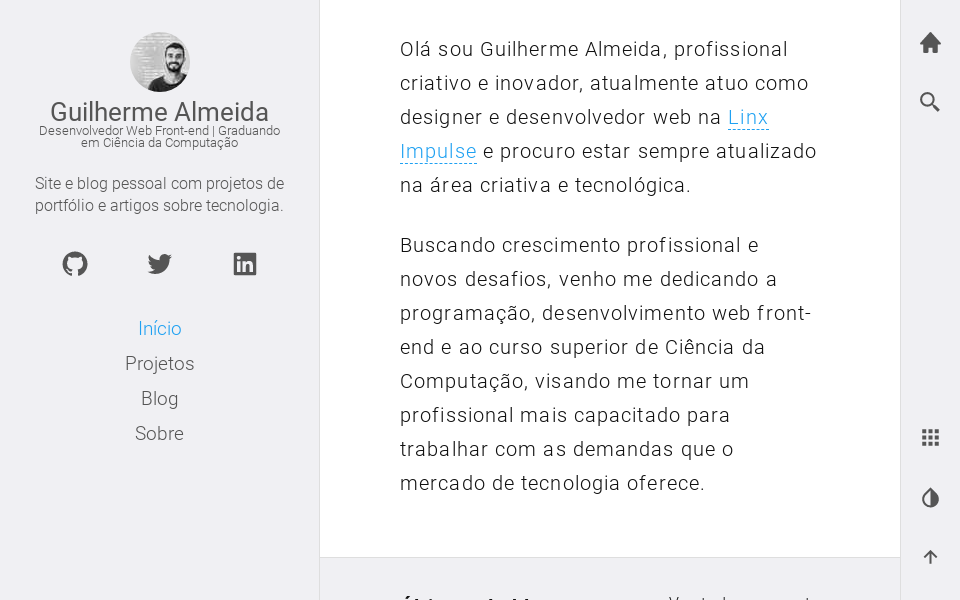

<p align="center">
  <a href="https://www.guisalmeida.com">
    
  </a>
</p>
<h1 align="center">
  <code>guisalmeida.com</code>
  <p align="center">
    <a href="https://app.netlify.com/sites/guisalmeida/deploys">
      
    </a>
  </p>
</h1>

<p align="center">
  <a href="https://www.guisalmeida.com">
    
  </a>
</p>

## Start
```bash
    git clone git@github.com:GuiSAlmeida/guisalmeida.com.git
    cd guisalmeida.com
    yarn install # or npm install

    #install gatsby cli
    npm install -g gatsby-cli

    # up server at http://localhost:8000/
    gatsby develop 
```

## 🚀 Technologies
- [ReactJS](https://pt-br.reactjs.org/);
- [Gatsby V3](https://www.gatsbyjs.org/);
- [GraphQL](https://graphql.org/);
- [Styled Components](https://styled-components.com/);
- [Styled Icons](https://styled-icons.js.org/);
- [Styled Media Query](https://github.com/morajabi/styled-media-query);
- [PrismJS](https://prismjs.com/);
- [Disqus](https://disqus.com/);
- [Algolia](https://www.algolia.com/);
- [Google Fonts](https://fonts.google.com/);
- [Markdown](https://daringfireball.net/projects/markdown/);
- [Netlify CMS](https://www.netlifycms.org/);


## ⚙️ TODO
* [x] Change color theme
* [x] Change scrollbar color
* [x] Make page 404
* [ ] Add tags in posts
* [ ] New feature to hide main menu in desktop
* [ ] Write tests
