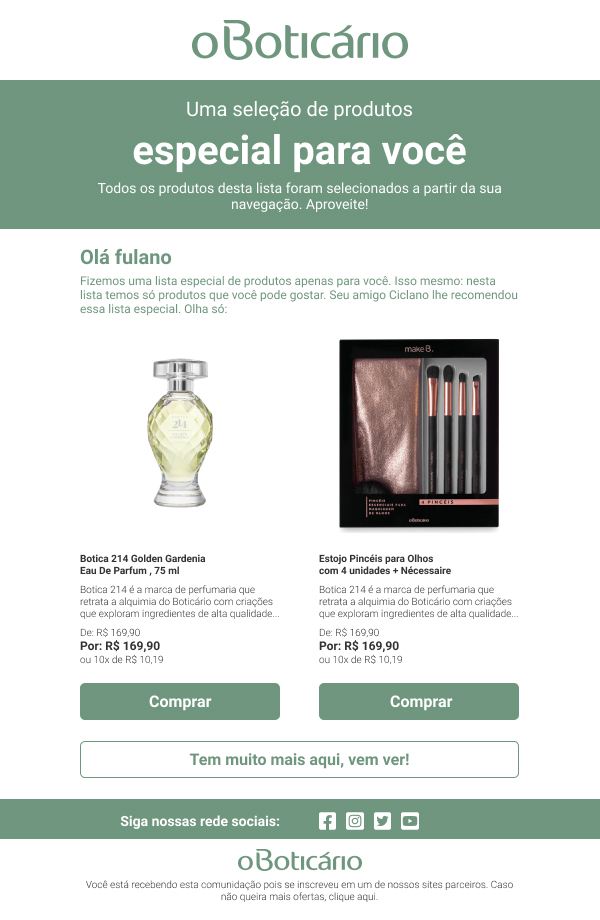
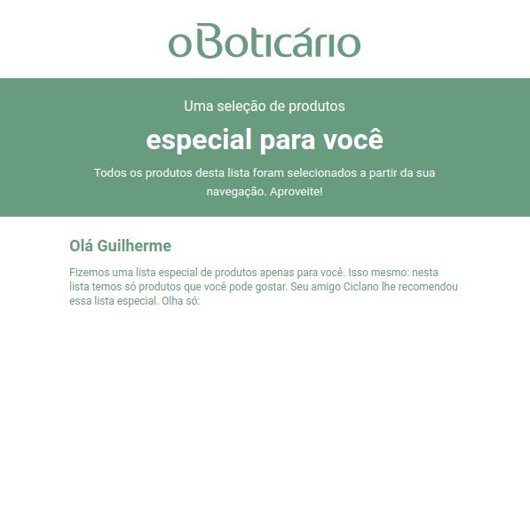
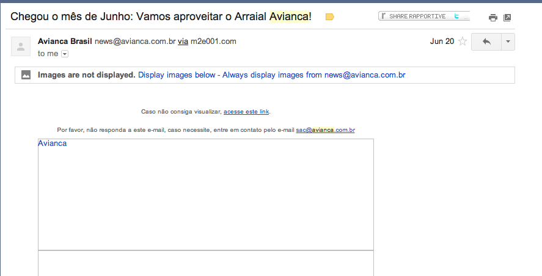
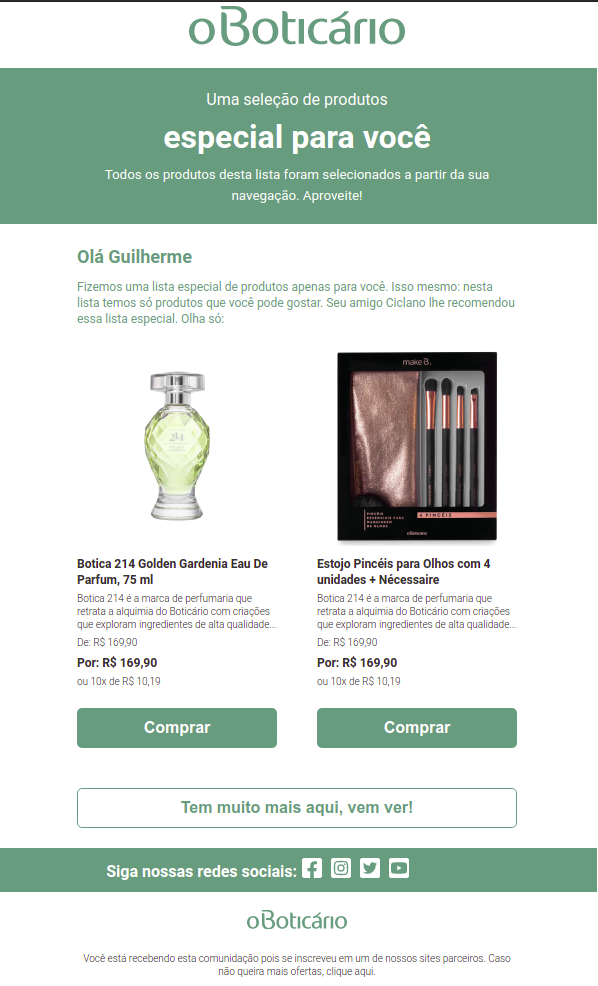
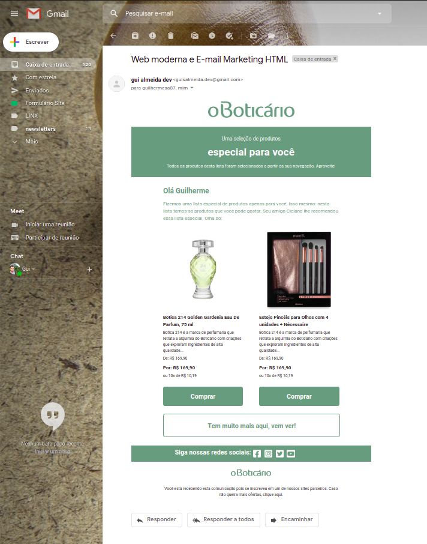
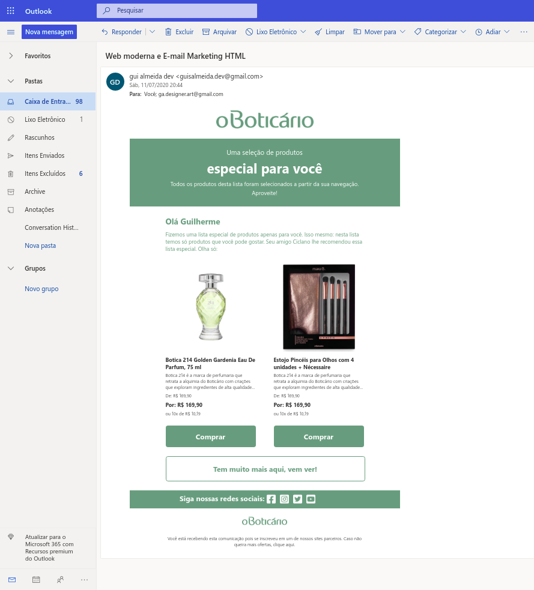

### Motivação
Atualmente lá na Linx trabalho diariamente com clientes de e-mail automatizado, um dos nossos produtos da solução [reengage](https://www.linx.com.br/transformacao-digital/linx-impulse/re-engage/), o que me motivou a pesquisar mais sobre o assunto e escrever este post para tirar algumas dúvidas a respeito de como criar campanhas de e-mail marketing de forma simples e descomplicada.  

<br>  

### Tá mas e ai? Muda alguma coisa?
Bom essa era a pergunta que eu me fazia até pouco tempo atrás e a responta é SIM muda bastante coisa. As técnicas para email marketing em HTML são um pouco diferentes e nem tudo que funciona em sites vai funcionar nas caixas de entrada.  
Mas a ideia desse post não é nos aprofundarmos tecnicamente em tudo que o e-mail suporta e todas suas especificidades. Pretendo aqui passar uma visão geral de como montar um template simples com dicas importantes para auxiliar quem está criando seu primeiro template de email em HTML.  

<br>  

### Começando pelo básico
Tenha noção que HTML de emails é diferente de HTML de sites.
Como citei na descrição do post algumas coisas que funcionam em sites não necessariamente funcionarão em email marketing, principalmente divs, sections, e folhas de estilo CSS externas, entre outras. Isso porque páginas da web sempre são renderizadas nos navegadores, enquanto o e-mail será renderizado de acordo com o provedor de email e cada um tem as suas regras. Portanto o ideal é simplificar e a melhor maneira é usando as tabelas do HTML como veremos a seguir.

<br>  

### Layout
Vamos criar nosso template apartir deste layout ao longo do post.  
Acesse o layout [aqui](https://www.figma.com/file/RYosfog8wshbbndVRoYE14/assets?node-id=5%3A3).  

  

<br>  

### Criando a estrutura básica
- O `DOCTYPE` declara o tipo de tags de HTML o documento tem e que tipo de regras esperar, em sites normais atualmente é usado HTML5 porém para e-mails o mais indicado é o XHTML 1.0. Para saber mais sobre as diferenças clique [aqui](https://www.campaignmonitor.com/blog/email-marketing/2019/05/correct-doctype-to-use-in-html-email/).
- Outro parâmetro importante que deve ser passado é o encoding em `UTF-8` que vai garantir que sua mensagem consiga ser lida corretamente em diversos clientes de email.
```html
<!DOCTYPE html PUBLIC "-//W3C//DTD XHTML 1.0 Transitional //EN" "http://www.w3.org/TR/xhtml1/DTD/xhtml1-transitional.dtd">
<html>
<head>
    <meta http-equiv="Content-Type" content="text/html; charset=UTF-8">
</head>
<body>
    <!--Conteudo mostrado em tela-->
</body>
</html>
```

<br>  

### Adicionando conteúdo com tabelas
- Adicionamos a tag `link` importando a fonte que estamos usando no layout, adicionamos o estilo inline com uma lista de fontes. O importante é sempre colocarmos fontes alternativas semelhantes para as situações em que a fonte principal não possa ser exibida.  
- Na tag `Table` é recomendado deixar os valores de `cellpaddding` e `cellspacing` como `0` para evitar espaços indesejados no seu email.  
- Nessa parte criamos três estruturas de uma linha e uma coluna para mostrarmos a logo, a chamada principal e a outra chamada.  

```html
<!DOCTYPE html PUBLIC "-//W3C//DTD XHTML 1.0 Transitional //EN" "http://www.w3.org/TR/xhtml1/DTD/xhtml1-transitional.dtd">
<html>
<head>
    <meta http-equiv="Content-Type" content="text/html; charset=UTF-8">
    <link href="https://fonts.googleapis.com/css2?family=Roboto:wght@400;700&display=swap" rel="stylesheet">
</head>
<body style="font-family: Roboto, Arial, Helvetica, sans-serif;">
    <table bgcolor="#fff" width="600px" cellpadding="0" cellspacing="0" border="0" style="margin: 0 auto;">
        <tr height="80">
            <td align="center">
                
            </td>
        </tr>
        <tr bgcolor="#6F967E">
            <td style="padding: 20px 80px; color: #fff;" align="center">
                Uma seleção de produtos
                <h1 style="margin: 5px 0;">especial para você</h1>
                <small>Todos os produtos desta lista foram selecionados a partir da sua navegação. Aproveite!</small>
            </td>
        </tr>
        <tr>
            <td style="color: #6F967E">
                <h2 style="margin: 20px 0 10px;">Olá Guilherme</h2>
                Fizemos uma lista especial de produtos apenas para você. Isso mesmo: nesta lista temos só produtos que você pode gostar. Seu amigo Ciclano lhe recomendou essa lista especial. Olha só:
            </td>
        </tr>
    </table>
</body>
</html>
```
Com isso já temos algumas coisas renderizando em tela:  

  

<br>  

### Cuidados com imagens
Antes de adicionarmos as imagens vale uma dica.  
Há uma prática ainda usada por algumas empresas que consiste em transformar todo e-mail em uma imagem, porém os provedores de e-mail possuem um bloqueio padrão de segurança para exibição de qualquer formato de imagem que esteja em um e-mail, sendo necessário o usuário aceitar a visualização das imagens.  

  
Crédito da imagem: https://resultadosdigitais.com.br/blog/template-html-email/

Isso não funciona bem como mostra a imagem acima. É preciso que o email mostre a que veio logo de cara. Ao usar apenas imagem, muitos destinatários irão ignorar o email, deletá-lo ou marcá-lo como spam.
Uma boa prática é usarmos uma proporção de 40% de imagens e 60% texto. Dessa forma, seu email fica mais leve e bem estruturado.
Como o conteúdo é para web tente deixar imagens com tamanho máximo de 100kb.  

<br>  

### Adicionando imagens
- Uma boa prática é colocar sempre o caminho abosoluto das imagens, evitando assim erros no carregamento.
- O atributo `ALT` oferece um texto alternativo quando alguma imagem não carrega ou não pode ser visualizada. Esse atributo é muito usado para melhorar a acessibilidade de uma página na web e principalmente de um E-mail Marketing, já que muitos clientes de e-mail bloqueiam as imagens enviadas por remetentes desconhecidos. Nesta situação, a função do atributo é facilitar a “pré-leitura” para o usuário.
- Procure não trabalhar com `.svg` alguns provedores como gmail não renderizam este tipo de arquivo.

```html
<!DOCTYPE html PUBLIC "-//W3C//DTD XHTML 1.0 Transitional //EN" "http://www.w3.org/TR/xhtml1/DTD/xhtml1-transitional.dtd">
<html>
<head>
    <meta http-equiv="Content-Type" content="text/html; charset=UTF-8">
    <link href="https://fonts.googleapis.com/css2?family=Roboto:wght@300;400;700&display=swap" rel="stylesheet">
</head>

<body style="font-family: Roboto, Arial, Helvetica, sans-serif;">
    <table bgcolor="#fff" width="600px" cellpadding="0" cellspacing="0" border="0" style="margin: 0 auto;">
        <tr height="80">
            <td align="center">
                
            </td>
        </tr>
        <tr bgcolor="#6F967E">
            <td style="padding: 20px 80px; color: #fff;" align="center">
                Uma seleção de produtos
                <h1 style="margin: 5px 0;">especial para você</h1>
                <small>Todos os produtos desta lista foram selecionados a partir da sua navegação. Aproveite!</small>
            </td>
        </tr>
        <tr>
            <td style="color: #6F967E; padding: 0 80px 20px; font-size: 12px;">
                <h2 style="margin: 20px 0 10px;">Olá Guilherme</h2>
                Fizemos uma lista especial de produtos apenas para você. Isso mesmo: nesta lista temos só produtos que você pode gostar. Seu amigo Ciclano lhe recomendou essa lista especial. Olha só:
            </td>
        </tr>

        <tr>
            <td>
                <table cellpadding="0" cellspacing="0" border="0" style="padding: 0 80px;">
                    <tr>
                        <td width="220px" style="padding-right: 20px; color: #333333">
                            
                            <p style="font-weight: 700; font-size: 12px; margin: 5px 0;">Botica 214 Golden Gardenia Eau De Parfum, 75 ml</p>
                            <p style="font-weight: 300; font-size: 10px; margin: 0 0 5px;">Botica 214 é a marca de perfumaria que retrata a alquimia do Boticário com criações que exploram ingredientes de alta qualidade...</p>
                            <p style="font-weight: 300; font-size: 10px; margin: 0;">De: R$ 169,90</p>
                            <p style="font-weight: 700; font-size: 12px; margin: 5px 0;">Por: R$ 169,90</p>
                            <p style="font-weight: 300; font-size: 10px; margin: 0;">ou 10x de R$ 10,19</p>
                            <a title="Comprar" href="https://github.com/GuiSAlmeida/email-mkt" rel="noopener noreferrer" target="_blank" style="padding: 16px 0; display: block; text-align: center; line-height: 100%; width: 100%; background-color: #6F967E; color: #fff; border-radius: 5px; border: none; cursor: pointer; margin: 20px 0; font-weight:700; font-size: 16px; text-decoration: none;">Comprar</a>
                        </td>
                        <td width="220px" style="padding-left: 20px; color: #333333">
                            
                            <p style="font-weight: 700; font-size: 12px; margin: 5px 0;">Estojo Pincéis para Olhos com 4 unidades + Nécessaire</p>
                            <p style="font-weight: 300; font-size: 10px; margin: 0 0 5px;">Botica 214 é a marca de perfumaria que retrata a alquimia do Boticário com criações que exploram ingredientes de alta qualidade...</p>
                            <p style="font-weight: 300; font-size: 10px; margin: 0;">De: R$ 169,90</p>
                            <p style="font-weight: 700; font-size: 12px; margin: 5px 0;">Por: R$ 169,90</p>
                            <p style="font-weight: 300; font-size: 10px; margin: 0;">ou 10x de R$ 10,19</p>
                            <a title="Comprar" href="https://github.com/GuiSAlmeida/email-mkt" rel="noopener noreferrer" target="_blank" style="padding: 16px 0; display: block; text-align: center; line-height: 100%; width: 100%; background-color: #6F967E; color: #fff; border-radius: 5px; border: none; cursor: pointer; margin: 20px 0; font-weight:700; font-size: 16px; text-decoration: none;">Comprar</a>
                        </td>
                    </tr>
                </table>
            </td>
        </tr>

        <tr>
            <td style="padding: 0 80px;">
                <a title="Tem muito mais aqui, vem ver!" href="https://github.com/GuiSAlmeida/email-mkt" rel="noopener noreferrer" target="_blank" style="display: block; text-align: center; width: 100%; padding: 16px 0; background-color: #fff; color: #6F967E; border-radius: 5px; border: 1px solid #6F967E; cursor: pointer; margin: 0 0 20px; font-weight:700; font-size: 16px;text-decoration: none;">Tem muito mais aqui, vem ver!</a>
            </td>
        </tr>

        <tr bgcolor="#6F967E" height="40px" style="vertical-align: middle;">
            <td align="right" width="50%" style="display: inline-block; font-size: 16px; font-weight: 700; color: #fff;">
                Siga nossas redes sociais:
            </td>
            <td  align="left" width="50%" style="display: inline-block; margin-top: 10px;">
                
                
                
                
            </td>
        </tr>

        <tr height="60">
            <td align="center">
                
            </td>
        </tr>
        <tr>
            <td align="center" style="padding: 0 80px; font-size: 10px; font-weight: 300; color: #333333;">Você está recebendo esta comunicação pois se inscreveu em um de nossos sites parceiros. Caso não queira mais ofertas, clique aqui.</td>
        </tr>
    </table>
</body>

</html>
```

Com isso já temos nosso layout finalizado com largura fixa:  

  

<br>  

### Ajustando textos
Acentos e caracteres especiais também podem não renderizar corretamente de acordo com cada provedor e devem ser substituidos por `Unicode`.

Se você usa o VS code, uma ferramenta que usamos para auxiliar nessa parte é a [HTML accented character converter](https://github.com/enriquein/htmlentity-replacer) que pode ser encontrado na aba extenções.  


- Acentos e caracteres especiais substituidos:  

```html
<!DOCTYPE html PUBLIC "-//W3C//DTD XHTML 1.0 Transitional //EN" "http://www.w3.org/TR/xhtml1/DTD/xhtml1-transitional.dtd">
<html>
<head>
    <meta http-equiv="Content-Type" content="text/html; charset=UTF-8">
    <link href="https://fonts.googleapis.com/css2?family=Roboto:wght@300;400;700&display=swap" rel="stylesheet">
</head>

<body style="font-family: Roboto, Arial, Helvetica, sans-serif;">
    <table bgcolor="#fff" width="600px" cellpadding="0" cellspacing="0" border="0">
        <tr>
            <td align="center">
                <table cellspacing="0" cellpadding="0" width="600">
                    <tr height="80">
                        <td align="center">
                            
                        </td>
                    </tr>
                    <tr bgcolor="#6F967E">
                        <td style="padding: 20px 80px; color: #fff;" align="center">
                            Uma sele&ccedil;&atilde;o de produtos
                            <h1 style="margin: 5px 0;">especial para voc&ecirc;</h1>
                            <small>Todos os produtos desta lista foram selecionados a partir da sua navega&ccedil;&atilde;o. Aproveite!</small>
                        </td>
                    </tr>
                    <tr>
                        <td style="color: #6F967E; padding: 0 80px 20px; font-size: 12px;">
                            <h2 style="margin: 20px 0 10px;">Ol&aacute; Guilherme</h2>
                            Fizemos uma lista especial de produtos apenas para voc&ecirc;. Isso mesmo: nesta lista temos s&oacute; produtos que voc&ecirc; pode gostar. Seu amigo Ciclano lhe recomendou essa lista especial. Olha s&oacute;:
                        </td>
                    </tr>
                </table>

                <table cellpadding="0" cellspacing="0" border="0" style="padding: 0 80px;">
                    <tr>
                        <td width="220px" style="padding-right: 20px; color: #333333">
                            
                            <p style="font-weight: 700; font-size: 12px; margin: 5px 0;">Botica 214 Golden Gardenia Eau De Parfum, 75 ml</p>
                            <p style="font-weight: 300; font-size: 10px; margin: 0 0 5px;">Botica 214 &eacute; a marca de perfumaria que retrata a alquimia do Botic&aacute;rio com cria&ccedil;&otilde;es que exploram ingredientes de alta qualidade...</p>
                            <p style="font-weight: 300; font-size: 10px; margin: 0;">De: R$ 169,90</p>
                            <p style="font-weight: 700; font-size: 12px; margin: 5px 0;">Por: R$ 169,90</p>
                            <p style="font-weight: 300; font-size: 10px; margin: 0;">ou 10x de R$ 10,19</p>
                            <a title="Comprar" href="https://github.com/GuiSAlmeida/email-mkt" rel="noopener noreferrer" target="_blank" style="padding: 16px 0; display: block; text-align: center; line-height: 100%; width: 100%; background-color: #6F967E; color: #fff; border-radius: 5px; border: none; cursor: pointer; margin: 20px 0; font-weight:700; font-size: 16px; text-decoration: none;">Comprar</a>
                        </td>
                        <td width="220px" style="padding-left: 20px; color: #333333">
                            
                            <p style="font-weight: 700; font-size: 12px; margin: 5px 0;">Estojo Pinc&eacute;is para Olhos com 4 unidades + N&eacute;cessaire</p>
                            <p style="font-weight: 300; font-size: 10px; margin: 0 0 5px;">Botica 214 &eacute; a marca de perfumaria que retrata a alquimia do Botic&aacute;rio com cria&ccedil;&otilde;es que exploram ingredientes de alta qualidade...</p>
                            <p style="font-weight: 300; font-size: 10px; margin: 0;">De: R$ 169,90</p>
                            <p style="font-weight: 700; font-size: 12px; margin: 5px 0;">Por: R$ 169,90</p>
                            <p style="font-weight: 300; font-size: 10px; margin: 0;">ou 10x de R$ 10,19</p>
                            <a title="Comprar" href="https://github.com/GuiSAlmeida/email-mkt" rel="noopener noreferrer" target="_blank" style="padding: 16px 0; display: block; text-align: center; line-height: 100%; width: 100%; background-color: #6F967E; color: #fff; border-radius: 5px; border: none; cursor: pointer; margin: 20px 0; font-weight:700; font-size: 16px; text-decoration: none;">Comprar</a>
                            
                        </td>
                    </tr>
                </table>

                <table cellpadding="0" cellspacing="0" border="0">
                    <tr>
                        <td style="padding: 0 80px;">
                            <a title="Tem muito mais aqui, vem ver!" href="https://github.com/GuiSAlmeida/email-mkt" rel="noopener noreferrer" target="_blank" style="display: block; text-align: center; width: 100%; padding: 16px 0; background-color: #fff; color: #6F967E; border-radius: 5px; border: 1px solid #6F967E; cursor: pointer; margin: 0 0 20px; font-weight:700; font-size: 16px;text-decoration: none;">Tem muito mais aqui, vem ver!</a>
                        </td>
                    </tr>
            
                    <tr bgcolor="#6F967E" height="40px" style="vertical-align: middle;">
                        <td align="right" width="50%" style="display: inline-block; font-size: 16px; font-weight: 700; color: #fff;">
                            Siga nossas redes sociais:
                        </td>
                        <td align="left" width="50%" style="display: inline-block; margin-top: 10px;">
                            
                            
                            
                            
                        </td>
                    </tr>
            
                    <tr height="60">
                        <td align="center">
                            
                        </td>
                    </tr>
                    <tr>
                        <td align="center" style="padding: 0 80px; font-size: 10px; font-weight: 300; color: #333333;">Voc&ecirc; est&aacute; recebendo esta comunica&ccedil;&atilde;o pois se inscreveu em um de nossos sites parceiros. Caso n&atilde;o queira mais ofertas, clique aqui.</td>
                    </tr>
                </table>
            </td>
        </tr>
    </table>
</body>

</html>
```  

<br>  

### Enviando nosso e-mail marketing
Para testar enviei o email para o gmail e outlook e segue resultado:  

  

  

<br>  

### Fontes para saber mais:
- https://blog.mailee.me/email-marketing-html/
- https://resultadosdigitais.com.br/blog/template-html-email/
- https://www.targetbox.com.br/page/tutoriais/o-uso-das-alt-tags-no-email-marketing
- https://ajuda.locaweb.com.br/wiki/boas-praticas-de-html-para-email-marketing-ajuda-locaweb/
- https://www.felipefialho.com/blog/tutorial-tabela-responsiva/
- https://www.campaignmonitor.com/blog/email-marketing/2019/05/correct-doctype-to-use-in-html-email/