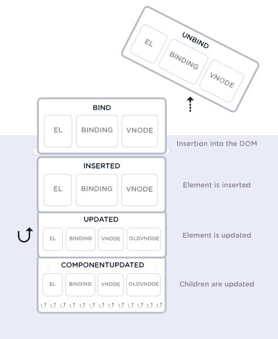

___
## Index

```toc
exclude: Index
```
---

## 1 Directives
They are properties passed inside the **html** tags, they work as follows:
```html
<template>
    <tag v-directive:argument.modifier="value" />
</template>
```

**v-bind**
Used before properties to access values within the Vue instance and bind to the tag's attribute.
```html
<template>
    <a v-bind:href="link">Google</a>
</template>
```
**v-once**
Used to access values within the Vue instance a **one time**, if the value is updated it will not change.
```html
<template>
    <p v-once>{{ title }}</p>
</template>
```

**v-text**
Used to insert text into a tag.
```html
<template>
    <p v-text="Using the v-text directive"></p>
</template>
```

**v-html**
Used to display Html code, if passed in double curly braces interpret data as **plain text**.
```html
<template>
    <p v-html="linkHtml"></p>
</template>

<script>
    const linkHtml = "<a href='http://google.com'>Google</a>"
</script>
```  

**ref**
Creates a reference to a DOM element.
```html
<template>
    <h1 ref="aulaRef">{{aula}}</h1>
</template>

<script>
    this.$refs.aulaRef.style.color = "red"
</script>
```

**v-model**
Links the view and the synchronized template, **two-way data binding**.
```html
<template>
    <input type="text" v-model="title">
</template>
```

**v-on**
Used to listen for the event.
```html
<template>
    <button v-on:click="sum">+1</button>
</template>
```

### 1.1 Modifiers

#### 1.1.1 Input modifiers (v-model)
Modifiers must be passed together with the `v-model` directive to handle input data from the input field.

**lazy**
Applies typed value only after focus leaves input field.
```html
<template>
    <input type="text" v-model.lazy="user.email">
</template>
```
**to trim**
Removes space at the beginning and end of the value entered in the input field.
```html
<template>
    <input type="text" v-model.trim="user.email">
</template>
```
**number**
Returns the value typed in the input field as a numerical value and not a string as it is by default.
```html
<template>
    <input type="number" v-model.number="user.age">
</template>
```

#### 1.1.2 Event Modifiers
Modifiers must be passed along with the `v-on` directive to control event behavior.

**stop (StopPropagation)**
Used directly in the directive, to stop the controlled event.

```html
<template>
    <p v-on:mousemove="showCoordinates">
        Mouse: {{ x }} and {{ y }}.
        <span v-on:mousemove.stop>Stop here</span>
    </p>
</template>
```

**prevent (PreventDefault)**
Used directly in the directive, to prevent the browser default behavior.
```html
<template>
    <a v-on:click.prevent href="http://guisalmeida.com">Site access</a>
</template>
```
**key (keys)**
Used to emit a specific event.
```html
<template>
    <input v-on:keyup="displayAlert" type="text">
    <!-- Call function every time a key is pressed -->
    <input v-on:keyup.enter="displayAlert" type="text">
    <!-- Call function only when pressed -->
    <input v-on:keyup.enter.alt="displayAlert" type="text">
    <!-- Call function only when enter+alt was pressed -->
</template>
```  

### 1.2 Conditionals
**v-if**
Used to create conditional logic in the html template.

> Delete element from DOM.
```html
<template>
    <p v-if="logged in">Logged in User: {{ name }}</p>
    <p v-else-if="anonymous">Anonymous User</p>
    <p v-else>No User Logged In</p>
</template>
```
**v-show**
Used to show or hide elements in HTML template.

> Does not delete DOM element, applies display: none.
```html
<template>
    <footer v-show="logged">Developed for you</footer>
</template>
```

### 1.3 Lists
**v-for**
Creates a repeating for loop on the element.

```html
<template>
    <!-- Loop with array -->
    <ul>
         <li v-for="(color, index) in colors">
             {{ color }} is at index {{ index }}
         </li>
    </ul>
    <!-- Loop with objects -->
    <ul>
         <li v-for="person in persons">
             <div v-for="(value, key, index) in person">{{index}}) {{ key }} = {{ value }}</div>
         </li>
    </ul>
</template>
```

### 1.4 Custom directives
Vue lets you register your own custom directives. Note that in Vue 2.0, the primary form of code abstraction and reuse is components - however, there may be cases where you only need low-level DOM access on simple elements, in which case custom directives would be useful.
For this, some hooks with arguments can be used:



#### 1.4.1 Global Policy
**Example**

In the `main.js` file:
```js
Vue.directive('highlight', {
    bind(el, binding) {
        let delay = 0
        if(binding.modifiers['delay']) delay = 2000

        setTimeout(() => {
            if(!binding.arg) {
                el.style.color = binding.value
                return
            }

            el.style.backgroundColor = binding.value
        }, delay);
    }
})
```
In the component:
```html
<template>
     <p v-highlight:background.delay="lightgreen">Using custom directive</p>
     <p v-highlight.delay="yellow">Using custom directive</p>
</template>
```

#### 1.4.2 Local Policy
**Example**
In the component:
```html
<template>
     <p v-highlight="value">Using custom locale directive</p>
</template>

<script>
     export default {
         directives: {
             "local-directive": {
                 bind(el, binding) {
                     // do something
                 }
             }
         },
     }
<script/>
```

---
## 2 Methods
Functions of each component.

**$event**
> By default when we call a function without passing any parameters,
> the event is passed automatically. If we need to pass a parameter
> and the event, we must use the `$event` keyword.
```html
<template>
    <button v-on:click="sum(5, $event)">+1</button>
</template>
```
---
## 3 Computed
Expressions within templates are very convenient, but they are intended for simple operations. Putting too much logic in them can make your code verbose and more difficult to maintain. That's why, for any more complex logic, we use **computed data**.

```html
<template>
     <div id="example">
         <p>Original message: "{{ message }}"</p>
         <p>Reverse message: "{{ reversedMessage }}"</p>
     </div>
</template>

<script>
    export default {
        data() {
            return {
                message: 'Hello Vue'
            }
        },
        computed: {
            reversedMessage: function () {
                return this.message.split('').reverse().join('')
            }
        }
     }
</script>
```

---
## 4 Watch
Asynchronous functions that keep track of property changes.

> Must have the same name as the property to be changed.

```html
<script>
    watch: {
        property(<newvalue>, <oldvalue>) {
            // do something
        }
    }
</script>
```

To monitor the **internal state** of each of the elements of the property being monitored, you must change the method with the name of the property to an object with an attribute called `deep: true` and the method that must be executed is passed in the `handler` attribute.

```html
<script>
    watch: {
        property: {
            deep: true,
            handler() {
                // do something
            }
        }
    }
</script>
```

---

## 5 Life Cycle


### 5.1 Lifecycle Methods

**beforeCreate**
Called once at instance creation, before instance creation.
**created**
Called once at instance creation, after instance creation.

**beforeMount**
Called only once on instance creation, before creating the template and throwing it into the DOM.

**mounted**
Called once on instance creation, when the DOM is mounted.

**beforeUpdate**
Called whenever there is a change to be applied to the DOM, before creating a template and throwing it into the DOM.

**updated**
Called whenever there is a change to be applied to the DOM, after creating a template and updating the DOM.

**beforeDestroy**
Called only once before the instance is destroyed.

**destroyed**
Called once after the instance is destroyed.


```js
new Vue({
     el: '#app',
     date: {
         title: 'Lifecycle'
     },
     beforeCreate() {
         console.log('before creating instance')
     },
     created() {
         console.log('after creating instance')
     },
     beforeMount() {
         console.log('before creating template and playing in DOM')
     },
     mounted() {
         console.log('when the DOM is mounted')
     },
     beforeUpdate() {
         console.log('before creating template and playing in DOM')
     },
     updated() {
         console.log('after creating template and updating the DOM')
     },
     beforeDestroy() {
         console.log('Called only once before the instance is destroyed');
     },
     destroyed() {
         console.log('Called once after the instance is destroyed')
     }
})
```


### 5.2 Additional Lifecycle Methods for Live Component
**activated**
Called when the component is first created, or reactivated after being deactivated.

**deactivated**
Called when the component is removed from the context but is not destroyed (keep-alive) keeping its state as if it were hidden and waiting to be reactivated.

---
## 6 Components
**slot**
It receives everything that was passed inside the component's tag to its scope without the need to use props, for example.
Several elements can be named to be identified in the component.

```html
<!-- Passing data inside the component -->
<template>
    <Component>
         <h1 slot="author">{{ citations[index].author }}</h1>
         <p slot="text">{{ quotes[index].text }}</p>
         <h6 slot="source">{{ quotes[index].source }}</h6>
    </Component>
</template>

<!-- Receiving data into the component -->
 <template>
    <div class="citation">
        <slot name="author"/>
        <slot name="text"/>
        <slot name="source"/>
    </div>
</template>
```

**keep alive**
Prevents that when reloading the page or replacing the component, it is not destroyed and created again, maintaining its current state when the component is accessed again.
> Can be heard in lifecycle methods:
> `activated(), deactivated()`  

```html
<template>
    <keep-alive>
        <component :is="component"/>
    </keep-alive>
</template>

```
---
## 7 Filters
Methods that can be created within the `filters` attribute where deal with a given data. The **syntax** works with a **pipe (|)** before and after the filter. They are supported within **tweens** and in the context of **v-bind** values.

**Example local filter:**
```html
<template>
    <div id="app">
        <p>{{ cpf | cpfFormat }}</p>
        <input type="text" :value="cpf | cpfFormat">
    </div>
</template>

<script>
    export default {
        data() {
            return {
                CPF: '01234567891'
            }
        },
        filters: {
            cpfFormat(value){
                const arr = value.split('')
                arr.splice(3, 0, '.')
                arr.splice(7, 0, '.')
                arr.splice(11, 0, '-')
                return arr.join('')
            }
        }
    }
</script>
```

**Example global filter:**
In the `main.js` file:
```js
Vue.filter('invert', (value) => {
    return value.split('').reverse().join('')
})
```
In the component:

```html
<template>
    <div id="app">
        <p>{{ cpf | reverse }}</p>
        <input type="text" :value="cpf | invert">
    </div>
</template>

<script>
export default {
    data() {
        return {
            CPF: '01234567891'
        }
    }
}
</script>
```

> Filters can be chained receiving the value returned from the previous filter:
> ```html
> <template>
>   <div id="app">
>       <p>{{ cpf | reverse | cpfFormat }}</p>
>       <input type="text" :value="cpf | reverse | cpfFormat">
>   </div>
> </template>
> ```


---
## 8 mixins
Mixins are a flexible way to distribute reusable functionality across multiple Vue components. A mixin object can contain any component options. When a component uses a mixin, all of its options will be mixed in with the component's own options.
`fruitsMixin.js`
```js
export default {
     date() {
         return {
             fruit: '',
             fruits: ['banana', 'apple', 'orange']
         }
     },
     methods: {
         add() {
             this.fruits.push(this.fruit)
             this.fruit = ''
         }
     },
}
```
The component will receive everything declared in the mixin and mix it with its own parameters when its instance is created.

`component.vue`
```html
<script>
import fruitsMixin from '@/fruitsMixin'

export default {
    mixins: [ fruitsMixin ]
}
<script/>
```

**Global mixing**
```js
vue.mixin({
    created() {
        console.log('Created GLOBAL mixin')
    }
})
```

---
## 9 Animations
Vue provides a wrapper component called `transition`, allowing you to add an input/output transition to any element or component within the following context:

- Conditional rendering (using `v-if`)
- Conditional display (using `v-show`)
- Dynamic components
- Components of root nodes

**Appear** - attribute used on the `transition` component for the applied effect to also work when the component is created in the dom.

### 9.1 Transitions classes
From the `name` attribute passed in the component, styles are created according to state.  


```js
<template>
    <transition name="fade" appear>
        <element/>
    </transition>
</template>

<style>
.fade-enter {}

.fade-enter-active {}

.fade-enter-to {}

.fade-leave {}

.fade-leave-active {}

.fade-leave-to {}
</style>
```
#### 9.1.1 Customizing Classes
You can also specify a custom transition class by providing the following attributes:
- enter-class
- enter-active-class
- enter-to-class (2.1.8+)
- leave-class
- leave-active-class
- leave-to-class (2.1.8+)

```html
<template>
    <transition enter-active-class="animated bounce" leave-active-class="animated shake">
        <element/>
    </transition>
</template>
```

#### 9.1.2 Dynamic Transitions
It is possible to pass a name to the `transition` element via binding and also has element changes within the transition via `v-if`. For this, it is necessary that each element has a unique key (key) and the `mode` directive must also be passed in the transition so that one element does not overlap the other.

```html
<template>
    <transition :name="animation" mode="out-in">
         <b-alert variant="info" show v-if="display" key="info">{{ msg }}</b-alert>
         <b-alert variant="warning" show v-else key="warning">{{ msg }}</b-alert>
    </transition>
    
    <!-- Can also be used with dynamic components -->
    <transition name="animation" mode="out-in">
         <component :is="componentSelected"></component>
    </transition>
</template>
```

### 9.2 Transition with JS Hooks


```html
<template>
     <button @click="display2 = !display2">Show</button>
     <transition
       :css="false"
       @before-enter="beforeEnter"
       @enter="enter"
       @after-enter="afterEnter"
       @enter-cancelled="enterCancelled"

       @before-leave="beforeLeave"
       @leave="Leave"
       @after-leave="afterLeave"
       @leave-cancelled="leaveCancelled"
     >
       <div v-if="display2" class="box"></div>
     </transition>
</template>

<script>
    export default {
        data() {
            return {
                display2: true,
            };
        },
        methods: {
            beforeEnter(el) {
                console.log('beforeEnter');
            },
            enter(el, done) {
                console.log('enter');
                done()
            },
            afterEnter(el) {
                console.log('afterEnter');
            },
            enterCancelled() {
                console.log('enterCancelled');
            },
            beforeLeave(el) {
                console.log('beforeLeave');
            },
            leave(el, done) {
                console.log('leave');
                done()
            },
            afterLeave(el) {
                console.log('afterLeave');
            },
            leaveCancelled() {
                console.log('leaveCancelled');
            }
        }
    };
</script>
```
---
## 10 Vue-Router
```
npm install vue-router
```

### 10.1 Configuration

`/src/router.js`
A Router object is created with the route configurations.
```js
import vue from 'vue'
import Router from 'vue-router'
import Component from './components/component'

Vue.use(Router)

export default new Router({
    routes: [
        {
            path: '/',
            component: component
        }
    ]
})
```

`/src/main.js`
In the main file where webpack generates the application bundle, the router is passed in the object created through the constructor function of vue.
```js
import vue from 'vue'
import App from './App.vue'
import router from './router'

new Vue({
   router, // router: router,
   render: h => h(App),
}).$mount('#app')
```

### 10.2 Navigation Modes
**Hash Mode**
Application default mode.
In the url: `localhost:8080/#/page`
In request: `localhost:8080/`

**History Mode**
In the url: `localhost:8080/page`
In request: `localhost:8080/pagina`

```js
export default new Router({
    mode: 'history',
    routes: [
        {
            path: '/',
            component: Component
        }
    ]
})
```

### 10.3 Global components
**Router-Link**
Used for navigation, the route is specified in the `to` prop.
A `<a>` tag will be rendered by default.
To change the rendered tag pass the `tag` prop.
It is also possible to pass prop to when the route is active and apply a class,
and also use `exact` to match exactly with the passed path.
```html
<template>
    <router-link
        to="/"
        tag="div"
        active-class="active"
        exact
    >Link</router-link>
</template>
```

**Router-View**
The result of the current route will render the **component** corresponding to **route**.
```html
<template>
    <router-view />
</template>
```

### 10.4 Dynamic Routes
Passing `props` in the route, the referenced component will receive this data passed in the path as props. Its declaration inside the component is also necessary.  

```js
// in the router
export default new Router({
    mode: 'history',
    routes: [
        {
            path: '/',
            component: Init
        },
        {
            path: '/user/:id',
            component: User,
            props: true
        }
    ]
})

// in the component
export default {
    props: ['id'],
}
```

In addition to `props`, it is also possible to access route data via the **component** via `this.$route.params`.
```js
export default {
    data() {
        return {
            id: this.$route.params.id
        }
    }
}
```

### 10.5 Nested Routes
To render nested components, we need to use the `children` option in the `VueRouter` **constructor** configuration.

> The `paths` of the nested routes will follow from the `path` of the main route.

```js
export default new Router({
    mode: 'history',
    routes: [
        {
            path: '/users',
            component: Users,
            children: [
                { path: '', component: UserList },                      // path = '/users'
                { path: ':id', component: UserDetail, props: true },    // path = '/users/:id'
                { path: ':id/edit', component: UserEdit, props: true }, // path = '/users/:id/edit'
            ]
        }
    ]
})
```

### 10.6 Naming Routes
Routes can be named making it easier to identify and understand the code.

```js
export default new Router({
    mode: 'history',
    routes: [
        {
            path: '/',
            name: 'home',
            component: Home
        }
    ]
})
```
In the component, we have more than one way to call the route.
> The router instance is globally accessible via `this.$router`.
```html
<template>
    <div class="App">
        <!-- To call the route by name passed inside an object -->
        <router-link to="{ name: 'home' }">Back</router-link>

        <!-- The route can also be loaded by a method -->
        <button v-on:click="toHome">Back</button>
    </div>
</template>

<script>
export default {
    methods: {
        toHome() {
            // this.$router.push('/')
            // this.$router.push({ path: '/' })
            this.$router.push({ name: 'home' })
        }
    }
}
</script>
```

### 10.7 Routes with multiple components
In the `VueRouter` **constructor** configuration we pass the components that should be rendered when loading the route.
```js
export default new Router({
    mode: 'history',
    routes: [{
        path: '/',
        name: 'home',
        components: {
            default: Home,
            menu: menu
        }
    }
}
```
In the template that will use the route component, more than one `router-view` can be passed to render more than one component according to the route. They are differentiated according to the name passed in the **Router**.
```html
<template>
    <div id="app">
        <!-- The router-view that is not passed the "name" attribute renders the component passed by default on the Router. -->
        <router-view />
        <router-view name="menu"/>
    </div>
</template>
```

### 10.8 Redirecting Routes
To redirect a route we pass the `redirect` option and in its value the path that should be redirected.
> To get anything that is typed and does not match our routes we pass a `*` (asterisk).
```js
export default new Router({
    mode: 'history',
    routes: [
        {
            path: '*',
            redirect: '/notfound'
        }
    ]
}
```

### 10.9 ScroolBehavior
When using client-side routing, we may want to scroll up when navigating to a new route, or preserve the scroll position of history entries the same way an actual page reload does. `vue-router` allows you to achieve this and, even better, it allows you to fully customize scrolling behavior in route navigation. In the `VueRouter` **constructor** configuration we can pass.

```js
export default new Router({
    mode: 'history',
    scrollBehavior(to, from, savedPosition) {
        if(savedPosition) {
            return savedPosition
        } else if (to.hash) {
            return { selector: to.hash, behavior: 'smooth' }
        } else {
            return { x: 0, y: 0, behavior: 'smooth' }
        }
    },
    routes: [{
        path: '/',
        name: 'home',
        component: Home
    }]
}
```

### 10.10. Intercepting Routes
Intercepting routes globally, the callback passed in `beforeEach` will be run before each route. In this step, we don't have access to `this` because the component hasn't been assembled yet.

```js
/**
  * to = source route
  * from = destination route
  * next = command that forwards to route,
  * without passing it, the route is not completed.
  * A specific route can be passed on next,
  * or pass a false for it not to follow.
  *
  *
  */
router.beforeEach((to, from, next) => {
    console.log('Run before all routes are called');
    next();
})
```
Intercepting directly on a route.

```js
const router = new Router({
    mode: 'history',
    routes: [{
        path: '/',
        name: 'home',
        component: Home,
        beforeEnter: (to, from, next) => {
            console.log('before local route');
            next();
        }
    }
}
```
Intercepting in the component that will be called by the route.

```js
export default {
    beforeRouteEnter(to, from, next) {
        console.log('Called before component route');
        next();
    }
}
```

It is also possible to intercept before leaving the route.
```js
export default {
    beforeRouteLeave(to, from, next) {
        if (this.confirm) {
            next()
        } else {
            if(confirm('Exit route?')) {
                next()
            } else {
                next(false)
            }
        }
    }
}
```

### 10.11 Late Routes
We can configure components that will be called in routes,
to be loaded only when they are called,
optimizing page loading.

```js
const Users = () => import('./components/user/Users')
const UserList = () => import('./components/user/UserList')
const UserDetail = () => import('./components/user/UserDetail')
const UserEdit = () => import('./components/user/UserEdit')
```

Grouping `JS` files in the same bundle to be loaded.
```js
const Users = () => import(/* webpackChunkName: 'user' */'./components/user/Users')
const UserList = () => import(/* webpackChunkName: 'user' */'./components/user/UserList')
const UserDetail = () => import(/* webpackChunkName: 'user' */'./components/user/UserDetail')
const UserEdit = () => import(/* webpackChunkName: 'user' */'./components/user/UserEdit')
```
---
## 11 Vuex
Vuex is a **state management pattern + library** for Vue.js applications. It serves as a centralized **store** for all components in an application, with rules ensuring that the state can only change in predictable ways.  


### 11.1 State
The central state of the application.
`/src/store/store.js` file is created
```js
import vue from 'vue'
import Vuex from 'vuex'

Vue.use(Vuex)

export default new Vuex.Store({
    state: {
        name: 'gui',
        surname: 'Almeida'
    }
})
```

Declare store in `main.js`
```js
import vue from 'vue'
import App from './App.vue'
import store from './store/store'

new Vue({
    store, // store: store
    render: h => h(App),
}).$mount('#app')
```

Accessing `state` in components
```html
<template>
    <p>{{ name }}</p>
</template>

<script>
export default {
    computed: {
        Name() {
            return this.$store.state.name
        }
    }
}
</script>
```

### 11.2 Getters
Functions that return information (data) from the state.  

Creating getters:
```js
export default new Vuex.Store({
    state: {
        name: 'gui',
        surname: 'Almeida'
    }
    getters: {
        fullname(state){
            `${state.firstname} ${state.lastname}`
        }
    }
})
```

A getter method can receive the `getters` of the entire application as a second parameter, even if they are created from other modules:

```js
export default new Vuex.Store({
    getters: {
        getAnotherModuleData(state, getters){
            return getters.anotherModuleGetter
        }
    }
})
```

Accessing getters in the component via `this.$store.getters` or the `mapGetters` method:
```html
<template>
     <p>{{ fullName }}</p>
</template>

<script>
import { mapGetters } from 'vuex'

export default {
    computed: {
        full name() {
            return this.$store.getters.fullName
        },
        ...mapGetters({
            'full name'
        })
    }
}
</script>
```

### 11.3 Setters (Mutations)
Change the global state of the application,
through `mutations` that have the purpose of changing the store directly and therefore must always be **synchronized**.


Creating mutations:
```js
export default new Vuex.Store({
    state: {
        name: 'gui',
        surname: 'Almeida',
        hobbies: []
    }
    getters: {
        fullname(state){
            `${state.firstname} ${state.lastname}`
        }
    },
    mutations: {
        addHobby(state, payload) {
            state.hobbys.push(payload)
        }
    }
})
```

**commit**
You cannot directly call a mutation from the component. Think of it more as event registration: "When a mutation with type `addHobby` is triggered, call this handler." To invoke a mutation, you need to call `store.commit` with its type.
Triggering **mutations** on the component via `this.$store.commit`:  

```html
<template>
    <p>{{ fullName }}</p>
    <p>Likes:</p>
    <input type="number" v-model="hobby">
    <button @click="addHobby">Add</button>

    <ul>
        <li v-for="hobby in hobbys">{{hobby}}</li>
    </ul>
</template>

<script>
export default {
    methods: {
        addHobby() {
            this.$store.commit('addHobby', hobby)
        }
    },
    computed: {
        hobbys() {
            return this.$store.state.hobbys
        }
    }
}
</script>
```

**mapMutations**
Creates a function in `methods` with the same name as the mutation created in the store.
Accessing mutations in the component via the `mapMutations` method:
```html
<template>
    <p>{{ fullName }}</p>
    <p>Like:</p>
    <input type="number" v-model="hobby">
    <button @click="addHobby">Add!</button>

    <ul>
        <li v-for="hobby in hobbys">{{hobby}}</li>
    </ul>
</template>

<script>
import { mapMutations } from 'vuex'

export default {
    methods: {
        ...mapMutations(['addHobby'])
    },
    computed: {
        hobbies() {
            return this.$store.state.hobbys
        }
    }
}
</script>
```

### 11.4 Actions
They call mutations through `commits`, we can perform **asynchronous** operations inside an action.

**dispatch**  
Method to trigger the actions.

```js
// in the store
export default new Vuex.Store({
    state: {
        products: []
    },
    mutations: {
        addProduct(state, payload) {
            state.products.push(payload)
        }
    },
    actions: {
        addProductAction(context, payload) {
            context.commit('addProduct', payload)
        }
    }
})

// in the component
export default {
    methods: {
        add() {
            this.$store.dispatch('addProductAction', product)
        }
    }
}
```

**mapActions**  
Create a function in `methods` with the same name as the action created in the store.

```js
// in the store
export default new Vuex.Store({
    state: {
        products: []
    },
    mutations: {
        addProduct(state, payload) {
            state.products.push(payload)
        }
    },
    actions: {
        addProductAction(context, payload) {
            context.commit('addProduct', payload)
        }
    }
})

// in the component
import { mapActions } from 'vuex'

export default {
    methods: {
        ...mapActions(['addProductAction']),
        add() {
            this.addProductAction(product)
        }
    }
}
```

### 11.5 Modules
Vuex allows us to divide our store into modules.
Each module can contain its own state, mutations, actions, getters, and even nested modules.

```js
const moduleA = {
   state: { ... },
   getters: { ... },
   mutations: { ... },
   actions: { ... },
}

const moduleB = {
   state: { ... },
   mutations: { ... },
   actions: { ... }
}

const store = new Vuex.Store({
    modules: {
        a: moduleA,
        b: moduleB
    }
})

this.$store.state.a // -> `moduloA`'s state
this.$store.state.b // -> `moduloB`'s state
```

### 11.6 Namespacing
By default, actions, mutations, and getters within **modules** are still registered under the **global namespace** - this allows multiple modules to react to the same type of action/mutation.
If you want your modules to be more independent or reusable, you can mark them as **namespaced** with `namespaced: true`.
When the module is registered, all getters, actions, and mutations will be automatically named based on the path in which the module is registered.  

```js
const store = new Vuex.Store({
    modules: {
        account: {
            namespaced: true,

            // module assets
            state: { ... }, // module state is already nested and not affected by the namespace option
            getters: {
                isAdmin() { ... } // -> getters['account/isAdmin']
            },
            actions: {
                login() { ... } // -> dispatch('account/login')
            },
            mutations: {
                login() { ... } // -> commit('account/login')
            },

            // nested modules
            modules: {
                // inherits namespace from the parent module
                myPage: {
                    state: { ... },
                    getters: {
                        profile() { ... } // -> getters['account/profile']
                    }
                },

                // further nest the namespace
                posts: {
                    namespaced: true,
                    state: { ... },
                    getters: {
                        popular() { ... } // -> getters['account/posts/popular']
                    }
                }
            }
        }
    }
})
```

---
## 12 Plugins
**Official vue plugins**: @vue/cli-plugin-pluginname  
**Ex.:** @vue/cli-plugin-babel

**Third-party plugins**: vue-cli-plugin-pluginname  
**Ex.:** vue-cli-plugin-electron-builder

---
## 13 References

- Official Documentation Vue2: https://vuejs.org/v2/guide/
- Vue Developer Tools: https://github.com/vuejs/vue-devtools
- Vuex documentation: https://vuex.vuejs.org/guide/
- Vue CLI: https://cli.vuejs.org/

---
## 14 Conclusion
What did you think of this post? Do you have any suggestions or criticisms? Leave a reaction or a comment below. And thanks for visiting! 😉