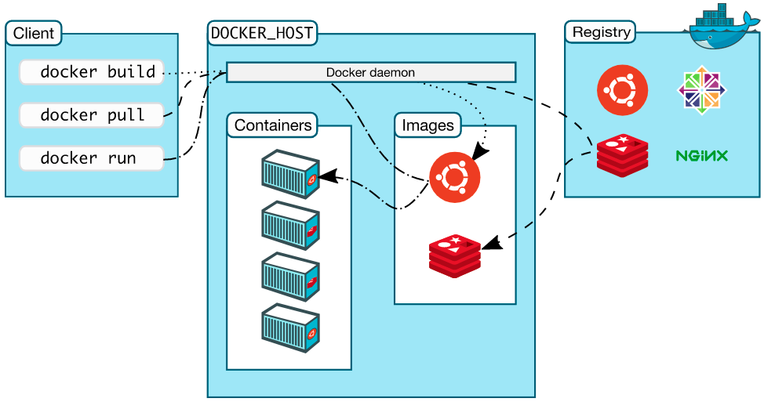
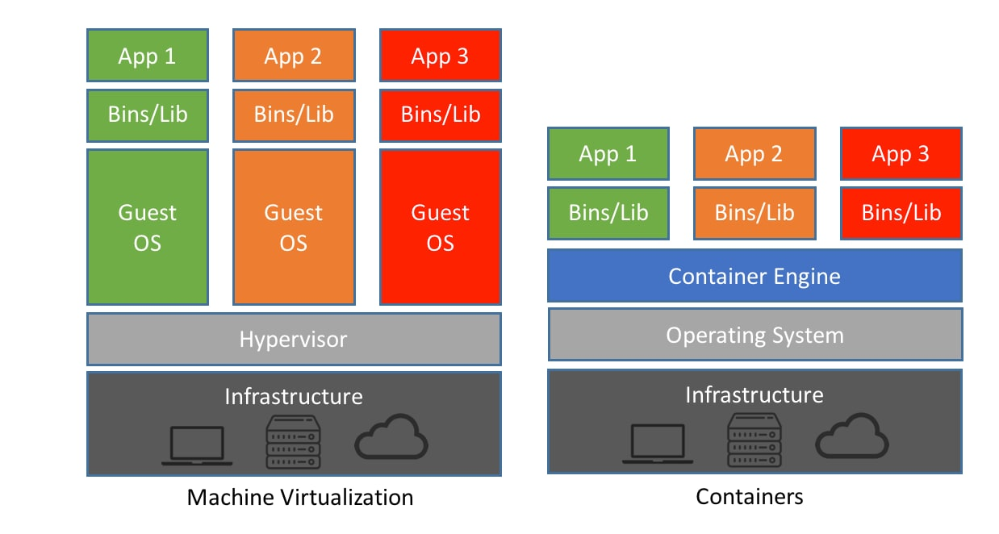
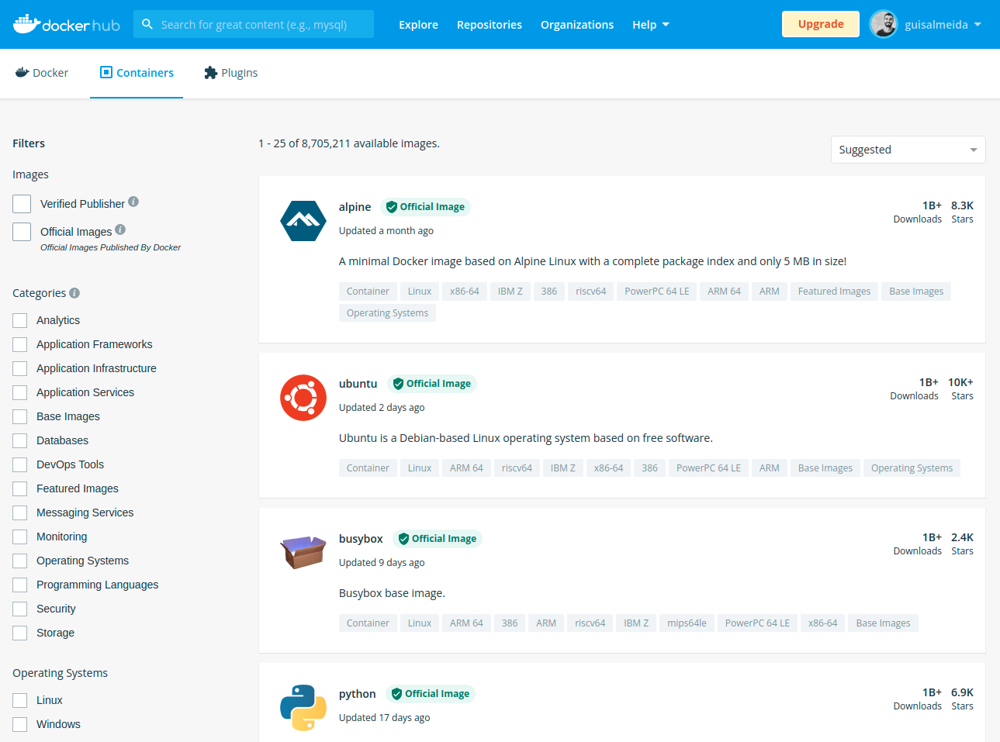

___

## Index

```toc
exclude: Index
```
---

## 1 Intro
**Docker** is a tool that allows us to create software packages in standardized units called **containers**, which contain everything the application needs to run, including libraries, system tools, code, etc.
It was developed in the **Go** programming language and its operation is made possible by [Container Linux](https://www.redhat.com/pt-br/topics/containers/whats-a-linux-container), which is a Linux kernel system.

### 1.1 Ecosystem
Docker has an ecosystem basically formed by the **command line (CLI)** where commands are passed. **Docker host**, software installed on the OS that has a process called **Docker daemon** that is processing all commands passed. And the **Registry** ([Docker Hub](hub.docker.com)), which is the remote registry where application images are saved to be used later.



### 1.2 Container is not a VM
Containers make it possible to use isolated resources, unlike a virtual machine, which depends on creating a complete operating system for each module.



### 1.3 Advantages of using Docker
The first advantage is that you won't need to install anything on your machine, just Docker (see how to install it on your OS [here](https://docs.docker.com/get-docker/)), this avoids polluting your environment with installations of various applications. Some other advantages can also be cited:
- Optimization of resources;
- Application packaging;
- Immutability;
- Ease of deployment.

---

## 2 Concepts
In Docker, we can find some concepts such as images, containers, and volumes.

### 2.1 Images
The image is the application we want to run. They are a read-only file system, which works with a stack of layers. These layers are created with each command given when creating an image.
We can create an image or use an already created image, which can be found in the Docker registry [Docker Hub](hub.docker.com).



#### 2.1.1 Useful commands for images
```sh
# Create an image from a local project:
docker build -t <name>[:tag] . # The point would be the path to the project where the build will fetch the Dockerfile to build the image

# Download image (docker hub):
docker pull <image>[:image_tag]

# List locally available images:
docker images

# View image settings:
docker image inspect <uuid | name>

# View layers (changes) of an image:
docker image history <uuid | name>

# Name and tag the image:
docker image tag <image_id> <image_name>[:image_tag]

# Delete image:
docker rmi <image>
```  

### 2.2 Container
Image instance running as a process. Configured as needed and made to be destroyed once finished.

#### 2.2.1 Useful commands for containers
```sh
# List locally available containers:
docker container ls -a

# Container settings:
docker container inspect <uuid | name>

# Create instance(container) of an image:
docker container run <uuid | name>

# Upload already created container:
docker container start <uuid | name>

# Stop container:
docker container stop <uuid | name>

# Delete container:
docker container rm <uuid | name>
```

### 2.3 Volumes
Volumes are the preferred mechanism for persisting data generated and used by Docker containers. Also, they are often a better choice than persistent data in the writable layer of a container, because a volume does not increase the size of the containers that use it, and the volume's contents exist outside the lifecycle of a given container.


#### 2.3.1 Configuring Volumes
We need to configure the volumes to map data out of our containers.
They can be configured together with the **command to create the container** passing the flag **-v** and the source and destination paths. This configuration will be saved in that specific container.
> Another container can be created from the same image with a different volume configuration.
```sh
docker container run -v $(pwd):/workspace ...
```

---

## 3 Dockerizing an Application
This term refers to converting an application to its normal operation, where we install all dependencies and execute some commands to run it locally, etc. So we can pass all this responsibility to Docker. So, after configuring it in our application, an image will be generated that will contain everything it needs and we just need to run a command to have everything running.

### 3.1 Requirements
To dockerize an application, we just need to have Docker installed and create a file called `Dockerfile` inside the project, where the settings that will make our application run inside the container will be.

### 3.2 Dockerfile
The Dockerfile is a text document that contains all the commands a user can call from the command line to build an image. Using the `docker build` command, users can create an automated build that executes several command-line instructions in succession.  

In the application folder, we create the `Dockerfile` with some details described in the comments:
```Dockerfile
# The FROM command says which image will serve as a reference for your application.
# Let's assume that our application is in python,
# then the FROM would look like this for example:
FROM python:3

# COPY will copy files/directories from our local application(.)
# inside the container create a folder /app.
COPY . /app

# The WORKDIR command tells which folder will be inside the container,
# where your code will be, and the next commands that will be run to create the container.
WORKDIR / app

# The RUN command runs commands when creating the image and each RUN generates a layer in the image.
# As an example, we are installing the dependencies we need for the python project
# inside our container, as soon as it is created.
RUN pip install -r requirements.txt

# EXPOSE exposes a port outside the container.
# In our case we are exposing port 5000.
EXPOSE 5000

# VOLUME maps a directory inside the container to be persisted outside.
# As an example, we are persisting the project's static folder.
VOLUME /static

# The CMD, different from RUN, runs a command when instantiating the image, that is, when we upload the container.
# As an example, we are running the main command with python for our application to run.
CMD python main.py
```

### 3.3 Build the image
Now that we have the Dockerfile configured, we just need to create the image that will have our application files, as if it were a compressed file.
Inside the folder where you saved the dockerfile, run the command:
```sh
docker build -t app-python:latest .
```
After that, the image will be registered on your machine.
This can be queried with:
```sh
docker images

# The following details will be shown:
REPOSITORY TAG IMAGE ID CREATED SIZE
app-python latest e42a1a90b7fe 10 seconds ago 931MB
```

### 3.4 Uploading container (running your application)
Now, we need to create the image instance (container) by passing some important settings the first time with the command:

```sh
docker run -v $(pwd)/static:/static -p 5000:5000 -d app-python:latest

# This command tells the software to run the image you created previously,
# mapping volume with the -v attribute the container's /static folder to the local /static.

# Map container ports to local PC (5000:5000) with -p attribute,
# with the first argument being the port of the local pc,
# and the second, the port inside the container defined in the dockerfile.

# The -d argument tells the software to run your container in the background,
# so the terminal window doesn't get stuck in the process.

# And finally we pass the name of the image that the container should be created.
```


Ready! With everything working, we can now test our Python APP at http://localhost:5000 in the same way as we would if it were running locally outside of a container.

After configuring the container, to upload it again, we just run the start command.
```sh
docker container start app-python
```

After all these commands are learned, depending on your project you can have also other parts that need to run in another container and you will need to run all these commands for each image you want to create and run as a container. It can become repetitive and unproductive, to improve that we can leverage other file configuration that allow us to set many commands in a structured way, the Docker compose file.  

## 4 Docker Compose
Compose simplifies the control of your entire application stack, making it easy to manage services, networks, and volumes in a single, comprehensible YAML configuration file. Then, with a single command, you create and start all the services from your configuration file.  

### 4.1 Creating the file
In the root of your project you can create a file `docker-compose.yml`, there you will set your container workflow.  
Let's set our compose file to do the same as we did on the step 3.4 when we were running `docker run -v $(pwd)/static:/static -p 5000:5000 -d app-python:latest`.

The file will be like this:
```yml
services: # Defines the services (containers) to be run
  app: # Name of the first service
    image: app-python # Specifies the image to use for the container
    volumes: # Mounts a volume
      - ./static:/static
    ports:
      - "5000:5000" # Maps port 5000 in the container to port 5000 on the host machine

  # Here we can have many others services that will run separetely as containers.
  # Check the docs to know more: https://docs.docker.com/compose/gettingstarted/
```

And after set up the file, the command to create images and run your services (containers) will be way more straightforward:
```sh
docker-compose up
```
Apart from helping us to up and run multiple containers from our project, it also simplifies the data that we need to pass on each command when using the docker CLI. This way all the data like port number, environment variables etc, can be already set up in this file. Let's check the main commands to use with docker compose.

### 4.2 Commands
**Start all services**: This command reads the `docker-compose.yml` file and starts up the defined containers.

```sh
docker-compose up -d
```
The `-d` flag runs everything in detached mode (background).

**View running services**:
```sh
docker-compose ps
```

**View logs**: Shows logs for each container, making it easy to debug.
```sh
docker-compose logs -f
```

**Stop all services**:
This stops and removes all containers, networks, and volumes defined in the `docker-compose.yml` file.
```sh
docker-compose down
```

**Rebuild images** (useful if you make changes to a Dockerfile):
```sh
docker-compose up --build -d
```

With `docker-compose`, you can quickly set up, test, and tear down a multi-container environment in a consistent way, making development and testing much simpler.


## 5 Publishing your app image to the docker registry
To upload an image we need to be registered with [Docker Hub](hub.docker.com).
After registering, we can log in locally through the terminal with the command:  
```sh
docker login
```

An important step that must be done when you are going to save your images in the docker remote registry. You need to create them with your username in front, otherwise, the push to your remote repository won't work.
Let's repeat the command that we created the image of our app now with our username created in the docker hub.
Example:
> ⚠️ The **username** must be the same configured there in the docker hub.
```sh
docker build -t <username>/app-python:latest .
```

Once logged in, you can push your local image to your remote registry account.
```sh
docker push <username>/app-python:latest
```

---

## 6 References
- https://docs.docker.com/get-docker/
- https://www.redhat.com/en/topics/containers/whats-a-linux-container
- https://dockerlabs.collabnix.com/beginners/docker/docker-vs-container.html
- https://learn.microsoft.com/en-gb/dotnet/architecture/microservices/container-docker-introduction/


---
## 7 Conclusion
Docker has become a powerful tool for development because it brings several advantages as we can see in this post. The ease of having your application running on different systems can save you a few hours trying to install libs on different systems. Undoubtedly knowledge that every developer needs to have in their toolbox.

What did you think of this post? Do you have any questions, suggestions or criticisms? Leave a reaction or a comment below. Thanks for visiting! 😉