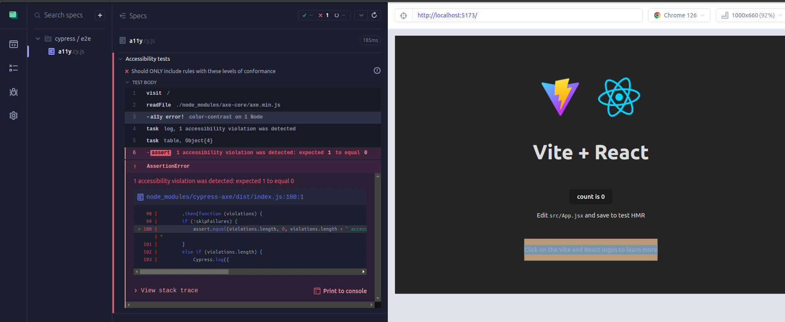

___

## Index

```toc
exclude: Index
```
---

> This post is the second part of a series of two posts about accessibility, you can read the second one here: [guisalmeida.com/accessibility-guidelines](/accessibility-guidelines/). 

## 1 Intro  
A social issue is always an attraction to stimulate technological developments and offer new tools to support communities in general. In the current context, the web has become almost indispensable in everyday life, somehow facilitating people's lives.

This brought a great challenge, ensuring that everyone has access to these technologies, which are mostly available through web pages. People with some type of disability still find it difficult to interact in this environment, making their experience negative and disregarding the rights that these citizens have before the laws to minimize segregation and discrimination.

User Interface tests are important to ensure that the application is functional for the end user, but how to ensure that in addition to functionality, your interface is also accessible. For this, we have to create specific tests that aim to validate several characteristics that make it difficult for users with disabilities to browse websites.  

### 1.1 Accessibility Guidelines
To test our sites and asses they are accessible, we need a parameter to follow. Knowing what you should do to cover most kinds of difficulty that the users can face when browsing your site is a great advantage that you can take. The WCAG guidelines became an international standard when it comes to accessibility. 

## 2 Testing Libraries  
Testing libraries are a solution designed to identify and correct bugs in an application's source code. They can be used to identify failures in the execution of functionalities, problems in the presentation of content or even serious errors, such as vulnerabilities that lead to leaks.
This way, the developer can easily correct problems and improve the application's performance.  

This section will cover the concepts required for the Cypress and Axe-Core libraries, each of which plays a fundamental role in the work. The first is widely used for integration testing and the second has several pre-established accessibility tests, as shown below.  

### 2.1 Cypress

This tool is intended to facilitate the work of automating web application tests. With Cypress, it is possible to test an interface that runs in the browser, largely due to the approach adopted by the tool to automate tests. Its first version was released in 2015, but its official launch was only made in 2017.

Cypress runs on Node (which is a JavaScript code interpreter), for this reason, the test codes or test cases must also be written in JavaScript, and it is not possible to write tests in other programming languages ​​to integrate with the library. Just by installing Cypress, it is already possible to write the tests, debug them and execute them, thus providing a complete test automation environment.


### 2.2 Axe-core  
*(https://github.com/dequelabs/axe-core)*  
An accessibility testing engine for websites and other HTML-based user interfaces. It is designed to integrate into an existing testing environment so that you can automate accessibility testing alongside regular functional testing. It is built to reflect how web development works. It is compatible with most browsers, tools, and testing environments currently used in development environments.

Axe-core performs accessibility validations according to different types of rules, and you can choose from versions (WCAG 2.0, 2.1, 2.2) at levels A and AA, as well as several best practices that help identify common accessibility practices. With it, accessibility testing can be performed as part of unit testing, integration testing, and browser testing, for example.

---

## 3 POC (proof of concept)

Let's start using [Vite](https://vitejs.dev/) to create and bundle our new project to serve as a POC (proof of concept).  
> Make sure yo have node 18+ and NPM already installed.

```sh
npm create vite@latest
```

Then following the prompts we will have some questions like the project name, framework e etc, and finally load the packages. For this example, I'm using React. After creating you can go to the project and install the dependencies.

```sh
cd project-name

npm install
npm run dev
```
 ### 3.1 Cypress configuration  
> All of these steps are in the Cypress docs you can refer at: https://docs.cypress.io/guides/getting-started/opening-the-app  

Now we have our project up and running, we start to set up our test environment.
Let's install the dependencies we need for the test:
After that, we need to set up Cypress to begin our tests, to do that we need to run:
```sh
npx cypress open
```

We can also add Cypress commands to the scripts field in your `package.json` file.
```json
{
  "scripts": {
    "cy:open": "cypress open"
  }
}
```
Now you can invoke the command from your project root like so:
```sh
npm run cy:open
```

Then a dialog window is opened where preferably the E2E tests option should be selected, as shown in the figure.


Next, a screen is shown with the files needed to run the tests that the library automatically generates, as shown in the figure.


Then just click on the continue button and select a browser to start testing. The chosen browser is then opened where it is possible to create test cases already in this interface as shown in the next figure or they can be created manually inside the cypress/e2e folder inside the project. As the parser will be responsible for running the tests, there is no need to create tests at this time, so this interface can be closed.


### 3.2 Axe-core Configuration  
> All of these steps are in the Cypress-axe docs you can refer at: https://github.com/component-driven/cypress-axe/blob/master/README.md#installation  

After the Cypress files are created it is necessary to make some adjustments for the integration with the Axe-core library within the project. The file from the `cypress/support/e2e.js` root folder should be updated with the line shown below to include the parser specific commands:  

```js
import 'cypress-axe';
```

In the `cypress.config.js` file in the root folder of the project, update with the following code:

```js
import { defineConfig } from "cypress";

export default defineConfig({
  e2e: {
    // here you can put your address pointing to your local
    baseUrl: 'http://localhost:5173',

    // to log the accessibility errors on console
    setupNodeEvents(on, config) {
      on('task', {
        log(message) {
          console.log(message)
          return null
        },
        table(message) {
          console.table(message)
          return null
        }
      })
    },
  },
});

```

Now let's finally go to our test file which we created in the beginning when we opened and configurated Cypress, in my case is `/cypress/e2e/a11y.cy.js` if you leave it as Cypress default it should be `/cypress/e2e/spec.cy.js`. There we will configure it as follows:

```js
/// <reference types="cypress" />

// Define at the top of the spec file or just import it
function terminalLog(violations) {
  cy.task(
    'log',
    `${violations.length} accessibility violation${violations.length === 1 ? '' : 's'
    } ${violations.length === 1 ? 'was' : 'were'} detected`
  )
  // pluck specific keys to keep the table readable
  const violationData = violations.map(
    ({ id, impact, description, nodes }) => ({
      id,
      impact,
      description,
      nodes: nodes.length
    })
  )

  cy.task('table', violationData)
}

describe('Accessibility tests', () => {
  it('Should ONLY include rules with these levels of conformance', () => {
    cy.visit('/');
    cy.injectAxe();
    cy.checkA11y(null, {
      runOnly: {
        type: 'tag',
        values: ['wcag2a', 'wcag2aa', 'wcag2aaa'] // here you can define which level of compliance you want
      }
    }, terminalLog)
  })
})
```

### 3.3 Testing
Now we can simply run the open command and check the results:
```sh
npm run cy:open
```
Running the accessibility tests the library will check if our interface has any issue related to the accessibility guidelines. As we can see it throws an error about color contrast, which you can now about in the W3C docs: https://www.w3.org/WAI/WCAG21/Understanding/contrast-minimum.html.  

  

We also received a report on the terminal as we configured before, it's handy when it comes to configuring your tests to run on a CI:  


After finding and understanding the issue we can fix it by changing to another color following the contrast rule.
You can test it online at: https://dequeuniversity.com/rules/axe/4.9/color-contrast  


Finally after our adjustments on text color, the results are good and our site is accessible.  

  

---

## 4 References
- https://docs.cypress.io/guides/getting-started
- https://github.com/component-driven/cypress-axe
- https://github.com/dequelabs/axe-core
- https://www.deque.com/axe/core-documentation/


---
## 5 Conclusion
Docker has become a powerful tool for development because it brings several advantages as we can see in this post. The ease of having your application running on different systems can save you a few hours trying to install libs on different systems. Undoubtedly knowledge that every developer needs to have in their toolbox.

What did you think of this post? Do you have any questions, suggestions or criticisms? Leave a reaction or a comment below. Thanks for visiting! 😉