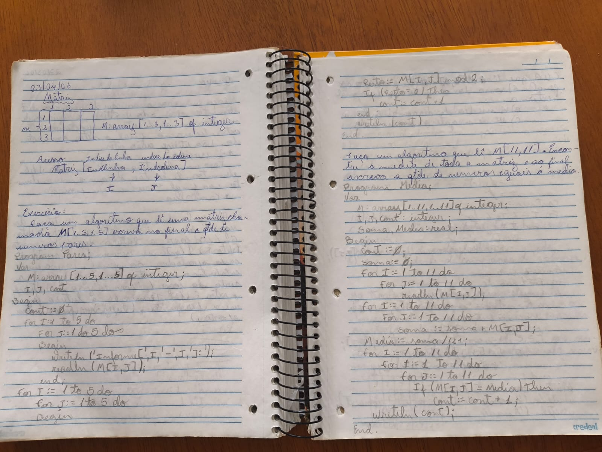
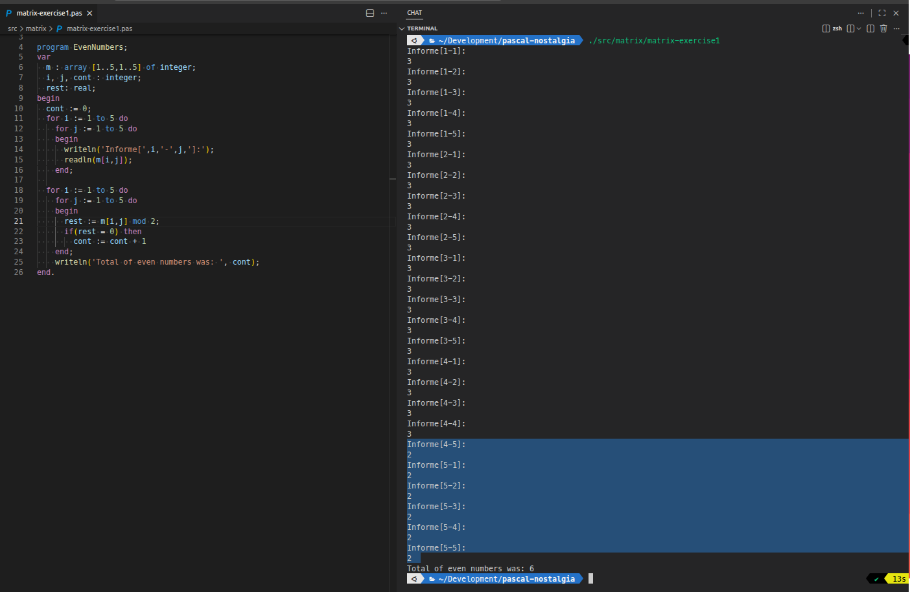
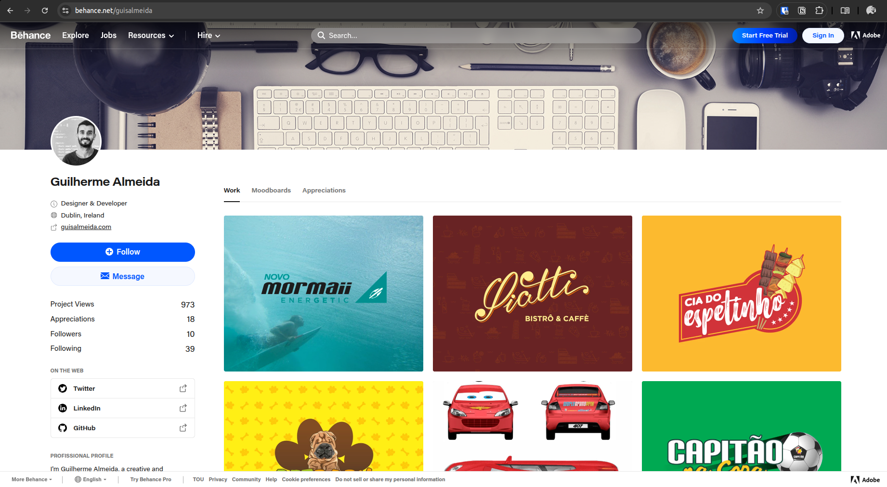
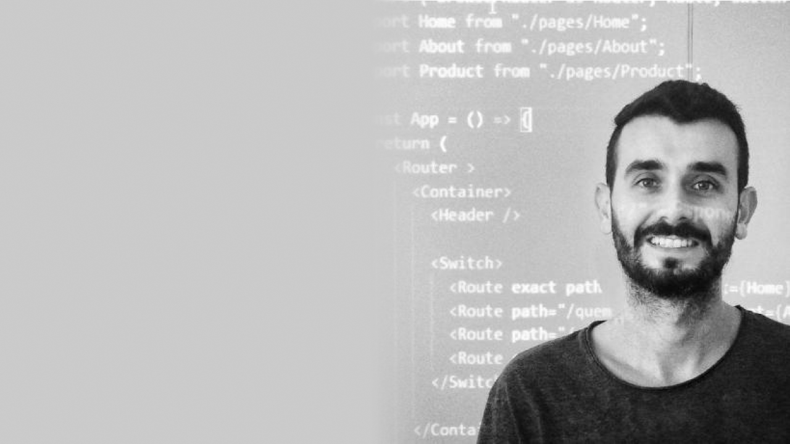

<!-- ## Index

```toc
exclude: Index
``` -->

---

## Where it all started  


In late 2005 and early 2006, I found myself in an IT technical course, and that’s where my journey with programming truly began. I was introduced to the world of hardware, software, programming basics, data structures, and algorithms. I literally wrote my very first line of code in Pascal, in my notebook! _Yes, on paper, something you rarely see these days, but it felt magical._

  

I still keep that notebook with me and inspired by this 20-year milestone, I decided to bring those old codes to life. I transcribed them from paper to computer, just to see if they would work, and they do! Sometimes all it takes is a missing comma or a forgotten variable.

You can find these memorable codes in my GitHub repo: https://github.com/guisalmeida/pascal-nostalgia  

  

Back then, I had no idea that this would eventually become my career.

It wasn’t a straight path. Programming wasn’t as popular as it is today. There were no YouTube tutorials, no bootcamps, no endless online courses. Learning resources were limited, mostly university degrees and books. The world of software development felt distant and mysterious.

So, after that first spark, I honestly didn’t know what to do next. There weren’t platforms overflowing with developer jobs or recruiters looking for devs. I’m not even sure “software developer” was a common job title yet. But the dream quietly stayed in my heart.

## Life moved on  

To support myself, I took regular jobs and decided to explore another side of my creativity in graphic design. For seven years, I dove into the world of design, creating logos, branding, storefront facades, installations, just about everything a designer can do. I even started my own company and built lasting relationships with clients. It was a wonderful chapter, full of growth and learning.

Some of my work still lives on in my [Behance portfolio](https://www.behance.net/guisalmeida) even if I don’t update it anymore.  

  

But programming never truly left me. It was always there, quietly waiting in the background, like an old friend.

As the years passed, I watched the tech world grow. I saw more and more people building amazing things, and I realized how valuable developers were becoming. Slowly, I decided to set aside my fears and that old impostor syndrome. I started to believe: _maybe I could do this, too._


## My career change

My curiosity and desire to learn led me to enroll in a Computer Science degree. Suddenly, I was back to that feeling from my school days, writing code again. This time, not in Pascal on paper, but in Java on a computer. Then, I landed my first job as a developer, and suddenly everything started to make sense.  

After years of quietly carrying that dream in the back of my mind, I finally made it real, I became a developer. Or maybe, deep down, I had always been one; I just hadn’t recognized it yet. I’m truly proud of this journey, and I’m excited for whatever project, challenge, or line of code comes next. The journey continues, and I can’t wait to see where it leads.

