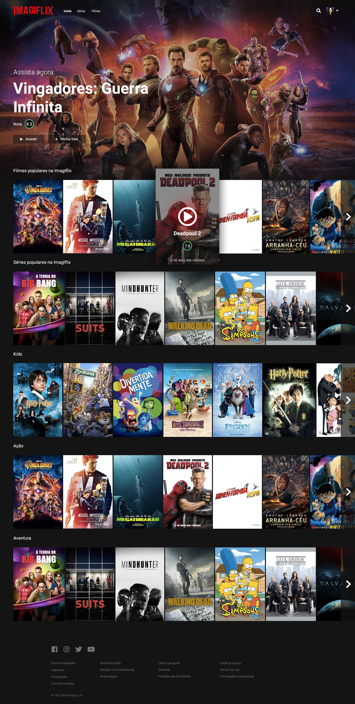

> Imagiflix é um site de filmes fictício feito no curso de front-end da [Imagine School](http://imagineschool.com.br/).

Acesse a [demo](https://imagiflix.netlify.app) do site ou [Repositório](https://github.com/GuiSAlmeida/imagiflix) no Github.

### 🎨 Layout

### 🛠️ **Tecnologias**
* HTML5
* CSS3 (Sass)
* JS (Jquery)
* [SLICK](http://kenwheeler.github.io/slick/)
* [TMDb](https://www.themoviedb.org)
* [NETLIFY](https://www.netlify.com/)

### ⚙️ **ToDo**
* [ ] Melhorar versão mobile
* [ ] Corrigir bug ao fechar tela trailer video continua rodando
