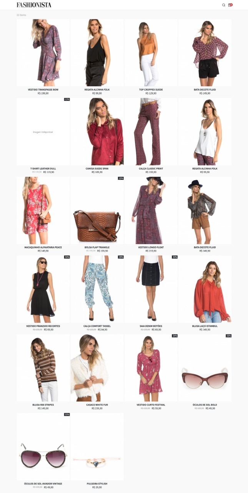
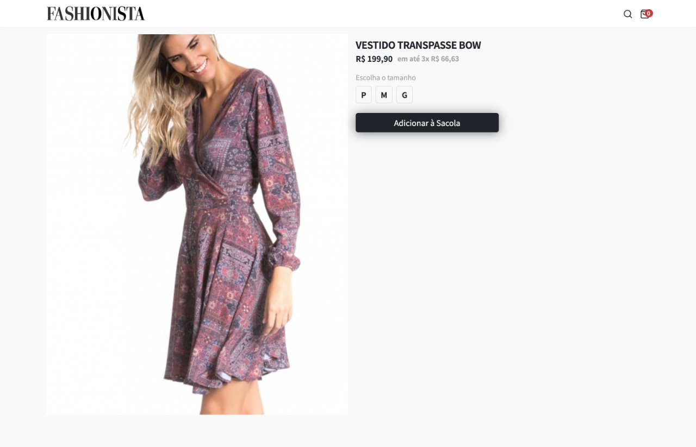
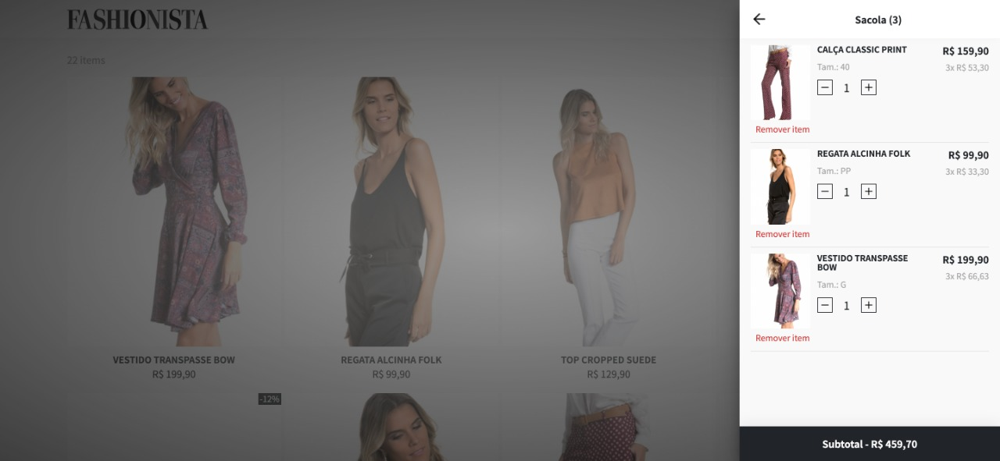
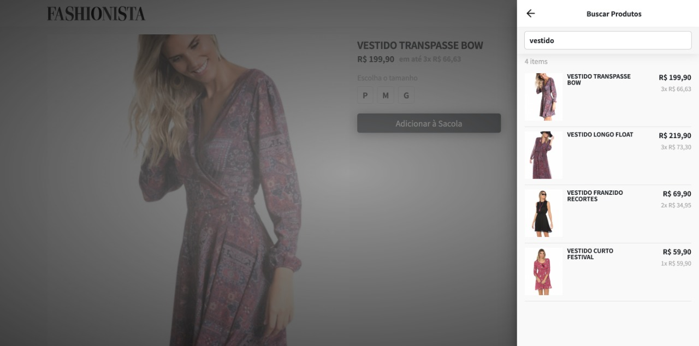

___
Fashionista is a fictional women's fashion e-commerce made as the final challenge of a React course.

    Source code:  
    <a href="https://github.com/GuiSAlmeida/aceleradev-fashionista" target="_blank">
        https://github.com/GuiSAlmeida/aceleradev-fashionista
    </a>
     
    Demo:
    <a href="https://fashionista-shop.netlify.app/" target="_blank">
        https://fashionista-shop.netlify.app/
    </a>

 
### **Home Layout**  

### **Product Page Layout**

### **Open Cart Layout**

### **Search Page Layout**

### 🛠️ **Technologies**
-   HTML5
-   CSS3 (Sass / BEM)
-   Atomic design
-   JS (ReactJS / Redux)
-   [NETLIFY](https://www.netlify.com/)

