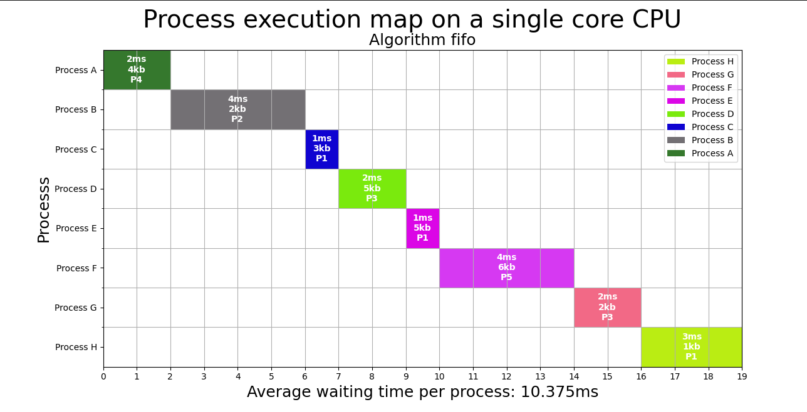
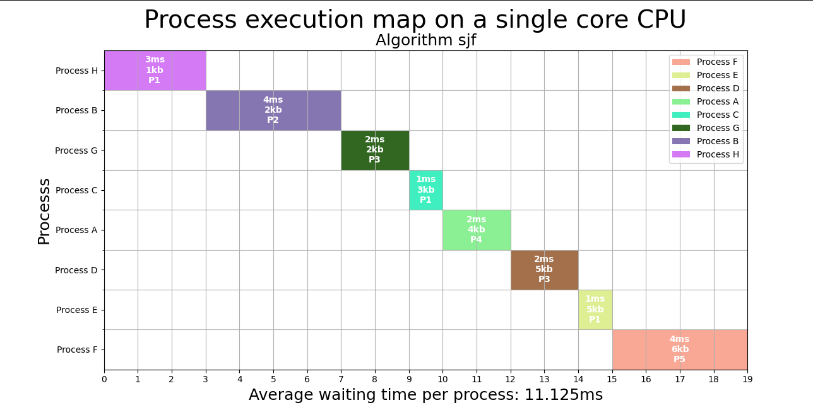
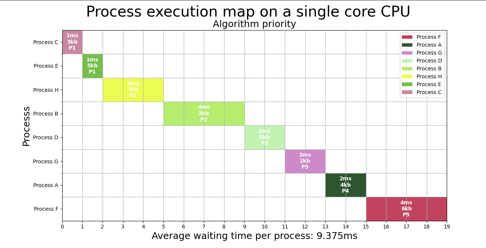

___
This project aims to create a gantt chart to simulate the scaling processes of the operating system, using algorithms such as FIFO, SJB and Priority. These algorithms order the processes and calculate the waiting time and the total time that each one obtained. Consequentely, it is possible to calculate the average waiting time that each process obtained and verify which algorithm obtained the best performance.

    Source code:  
    <a href="https://github.com/guisalmeida/OS-Scheduler" target="_blank">
        https://github.com/guisalmeida/OS-Scheduler
    </a>

### 🏆 Challenge
- Write an application, to simulate process scheduling policies in **Priority, FIFO and Shortest Job First** algorithms.

- Simulate a process queue where who is using the CPU, still using until finishing the process (Single core).

 
### 🗃️ Mock Data
|Process|Priority|Duration(ms)|Size(kb)|
|:---:|:---:|:---:|:---:|
|Process A|Priority 4|2|4|
|Process B|Priority 2|4|2|
|Process C|Priority 1|1|3|
|Process D|Priority 3|2|5|
|Process E|Priority 1|1|5|
|Process F|Priority 5|4|6|
|Process G|Priority 3|2|2|
|Process H|Priority 1|3|1|

### 📊 **FIFO**

### 📊 **Shortest Job First**

### 📊 **Priority**

### 🛠️ **Technologies**
- [Python](https://www.python.org/)
- [Matplotlib](https://matplotlib.org/): for gantt chart.
- [Pandas](https://pandas.pydata.org/): for read and write csv files.
- [Numpy](https://numpy.org/): for arrange data.

