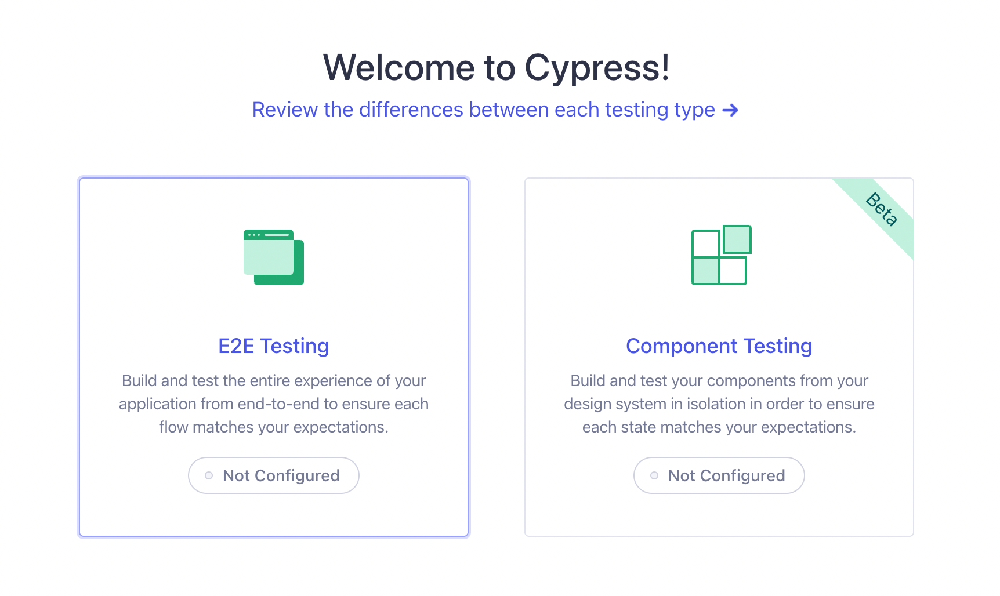

___  
## Index

```toc
exclude: Index
```

---

## 1 Intro

User Interface tests are important to ensure that the aplication is functional for the end user, but how to ensure that in addition to functional your interface is also accessible. For this, we have to create specific tests that aim to validate several characteristics that make it difficult for users with disabilities to browse websites.

### 1.1 What is the A11Y-Analyzer?

It is an accessibility testing tool to help teams develop accessible web interfaces from the beginning of the project. It aims to show where the possible errors are and show the documentation with their resolution.

### 1.2 What is A11Y?

“A11Y” is considered a numeronym meaning accessibility, with the number 11 representing the letter count between the letter A and the letter Y of the English word “accessibility”.


---

## 2 Usage

The analyzer's source code is stored on the NPM server, so it is possible to install it via the command line in the terminal, requiring the NodeJS and NPM tools already installed. The following commands must be executed to proceed with the installation:

```
npm install --save-dev a11y-analyzer
```

This command only installs the analyzer source code, it is also necessary to install the other libraries that make up the project's dependencies with the following command:


```
npm install --save-dev axe-core cypress cypress-axe cypress-terminal-report http-server start-server-and-test
```

### 2.1 Project configuration

With the parser and dependencies installed, the next step is to configure the project so that everything works correctly, as shown in the next section.

This is the most important step for the proper functioning of the analyzer in the project, as some files and folders need to be configured in a specific way, as shown below. Initially, the command must be executed to configure the Cypress test library within the project:

```
npx cypress open
```

Then a dialog window is opened where preferably the E2E tests option should be selected, as shown in the figure.



Next, a next screen is shown with the files needed to run the tests that the library automatically generates, as shown in the figure.


Then just click on the continue button and select a browser to start testing. The chosen browser is then opened where it is possible to create test cases already in this interface as shown in the next figure or they can be created manually inside the cypress/e2e folder inside the project. As the parser will be responsible for running the tests, there is no need to create tests at this time, so this interface can be closed.


After the Cypress files are created it is necessary to make some adjustments for the integration with the parser and the other libraries within the project. The file from the cypress/support/e2e.js root folder should be updated with the line shown below to include the parser specific commands:

```
import 'a11y-analyzer'
```

In the cypress.config.js file in the root folder of the project to be updated with the following code:

```js
const { defineConfig } = require("cypress");

module.exports = defineConfig({
  env: {
    "hideElements": true // To hide elements like XHR requests
  },

  e2e: {
    baseUrl: 'http://localhost:8080', // Choose you localhost
    screenshotOnRunFailure: false, // Don't take screenshots
    video: false, // Don't record videos
    setupNodeEvents(on, config) {
      require('cypress-terminal-report/src/installLogsPrinter')(on);
    },
  },
});

```


> To use require type import, make sure there is not a `"type": "module"`, within your package.json file, and if using Typescript and ES6 imports, make sure esModuleInterop is enabled.

To run the analyzer in a web project, it is necessary that the interface is already being compiled and exposed on a local port on the machine or hosted on a server. To run the tests in the project's interface, you need to create a file inside the `cypress/e2e` folder. In the cypress test notation, each test case is executed by the `it()` method, inside it it is necessary to pass the `cy.analyseA11y()` analyzer command, as it is responsible for executing the battery of accessibility tests.

It is also possible to pass some settings by parameter to the command, each setting has a different behavior and serves a specific purpose. They are presented below separately only for more didactic purposes, but they can be done all in a single command if the developer so needs.

### 2.2 Writing tests

Below are some of the main usage examples and specific settings that can be made with the analyzer:

#### 2.2.1 Overal test

In the first test case, only one parameter is assigned that specifies the address of the interface that must be tested, this can either be a link to the local server or a web address, it is the only mandatory parameter that must be assigned. Therefore, all types of accessibility criteria will be evaluated making this scenario the most complete as no rule is being ignored or excluded.


```js
it('Should log any accessibility failures', () => {
  cy.analyseA11y('https://example.cypress.io');
})
```

#### 2.2.2 Especifing elements

In the second test case, the possibility of specifying an element in the interface where you want to make an exclusive test is presented, thus eliminating the tests in the rest of the interface.

```js
it('Should execute ONLY specific elements on the page', () => {
  cy.analyseA11y('https://example.cypress.io', '.container', null);
})
```

#### 2.2.3 Excluding elements

In the third test case, the configuration for excluding such element from the interface is presented, so the analyzer will check everything else.

```js
it('Should exclude specific elements on the page', () => {
  cy.analyseA11y('https://example.cypress.io', { exclude: ['.banner'] }, null);
})
```

#### 2.2.4 Choosing impact level

In the fourth case, an accessibility impact level that you want to test is specified, there are four levels: minor, moderate, serious and critical. Choosing the last two as in the example, lower level alerts and errors will not be displayed.

```js
it('Should ONLY include rules with serious and critical impacts', () => {
  cy.analyseA11y('https://example.cypress.io', null, {
    includedImpacts: ['critical', 'serious']
  });
})
```

#### 2.2.5 Excluding elements

In the fifth case, it is also possible to select the type of rule to be excluded from the check, such as color contrast.

```js
it('Should exclude specific accessibility rules', () => {
  cy.analyseA11y('https://example.cypress.io', null, {
    rules: {
      'color-contrast': { enabled: false }
    }
  });
})
```

#### 2.2.5 WCAG levels

Finally, the sixth case shows how it is possible to configure the analyzer so that it tests according to the criticality levels according to WCAG.

```js
it('Should ONLY include rules with these levels of conformance', () => {
  cy.analyseA11y('https://example.cypress.io', null, {
    runOnly: {
      type: 'tag',
      values: ['wcag2a', 'wcag2aa']
    }
  });
})
```

### 2.3 Results

Once run in both the terminal and the Cypress test interface, the analyzer runs its predefined tests, where it interacts with the system it was installed on. When accessibility violations are detected, it issues an error signaling that the test failed, with a message containing a summary of the error, the type of impact, link to the documentation and the HTML elements that contain the error in the system's web interface. In the test interface, while the test commands are executed, it is possible to see the interactions with the interface in real time.


Finally, everything found is listed, where you can see how many tests were run, how many passed, how many failed, and how long they took to run.


---

## 3 Conclusion

This project helped me a lot to put into practice concepts of **accessibility**.

So, what did you think of this project? Do you have any suggestions or criticism? Leave a reaction or a comment below. And thanks for visiting! 😉